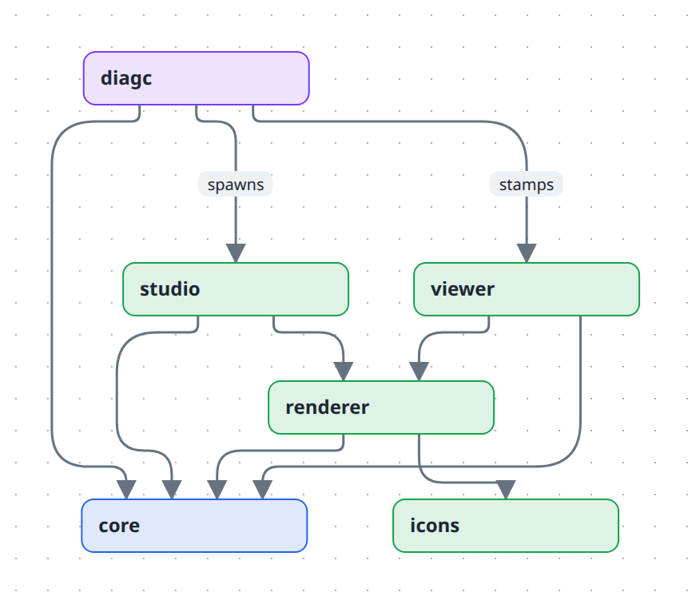

# Contributing

Contributions are welcome — bug reports, fixes, docs, and features alike.

## The CLA, and why it exists

Every contributor signs a [Contributor License Agreement](CLA.md) before their first
pull request is merged. A bot comments on your PR with a link; signing takes a minute
and covers everything you contribute afterwards.

It is worth being direct about why, because CLAs are often sprung on people:

This project is **dual-licensed**. Everyone gets it under AGPL-3.0, and separately, a
commercial licence is available to anyone who needs terms the AGPL does not give them —
embedding it in a proprietary product, or running it as a hosted service without
publishing their source. That second option is only possible if one party can license
the whole codebase, and copyright law means every contributor owns their own
contribution by default. Without a CLA, a single merged pull request would permanently
remove the ability to license the files it touched.

In exchange, [section 4 of the CLA](CLA.md#4-our-commitment-to-you) commits that your
contribution stays available under the AGPL permanently. It cannot be quietly moved to
a closed licence later.

You keep your copyright. The CLA is a licence, not an assignment — you can reuse your
own work anywhere you like.

If you would rather not sign, please still open an issue describing the bug or the idea.
A clear report is genuinely useful and carries no paperwork.

## Getting set up

Needs **Node ≥ 22** (the repo pins Node 24 in `mise.toml`) and **pnpm 10** (`corepack enable` once).

```bash
pnpm install
pnpm dev          # compile watcher + studio at http://localhost:5173
```

The repo's own diagrams live under `.diagrams/src/` — the docs' figures and the examples — so
`pnpm dev` renders something immediately.

### Running a checkout as `diagc`

To try the working tree against another repository on your machine, put the dev entry on your
PATH:

```bash
pnpm build:cli        # once — the viewer shell `publish` stamps models into
pnpm link --global    # `diagc` now runs this checkout, from any directory
```

`bin/diagc.mjs` finds the monorepo by walking up from its own real path to `pnpm-workspace.yaml`
(`packages/diagc/src/home.ts`), so the linked `diagc` works anywhere — and breaks everywhere if
the checkout moves or its `node_modules` go. It runs the studio's Vite dev server instead of the
prebuilt bundle, resolves `@diagc/core` back to this checkout, and needs `pnpm build:cli` again
after a viewer change or published pages keep the old shell. Nothing pins a version: every
repository on the machine runs whatever the checkout is at. An installed `@diagc/cli` has none of
these strings attached, which is why the tutorials and how-tos never mention the link.

## The packages



| Path | Package | Role |
| --- | --- | --- |
| `packages/core` | `@diagc/core` | Builder DSL, the JSON model + validation, the view compiler. **Published.** |
| `packages/renderer` | `@diagc/renderer` | React `DiagramView` (React Flow + elk) and the type/kind/theme registries. |
| `packages/icons` | `@diagc/icons` | Icon id → lucide component. |
| `packages/diagc` | `@diagc/cli` | The `diagc` CLI: init, compile, lint, watch, publish, studio, eject, diff, guide. **Published.** |
| `apps/studio` | `@diagc/studio` | The browser app and its dev-server API. |
| `apps/viewer` | `@diagc/viewer` | The single-file shell `publish` stamps a model into. |

To change what the renderer draws when you use `DiagramView` yourself inside the workspace, see [Renderer registries and theme](docs/reference/renderer.md).

## Before you open a pull request

```bash
pnpm test         # vitest, whole repo
pnpm typecheck    # seven chained tsc projects
pnpm lint         # eslint
```

CI runs the same three on every pull request, plus the release build (`pnpm build:dist`) —
running them first saves a round trip.

## Conventions worth knowing

- **Tests live beside the code** (`foo.ts` + `foo.test.ts`) and coverage is close to
  complete. A new module without a sibling test is out of step with the codebase.
- **Comments explain why, not what.** Several dependency arrays and render-phase refs in
  `DiagramView`, `useEditor` and `useDeepLink` encode fixed race conditions — read the
  surrounding comment before changing one.
- **New editing capability means a new `EditorCommand`** in `packages/core/src/commands.ts`
  with tests, then UI wiring — not ad-hoc mutation in a component.
- **`packages/core` depends on nothing.** No React, no filesystem. That boundary is the
  one structural rule worth preserving: the model does not know it is going to be drawn.
- **Generated files are generated.** `apps/studio/src/library/packs.aws.ts` and
  `apps/studio/public/library/**` come from the scripts in `scripts/` — edit the script,
  not its output.

The architecture and the reasoning behind it live in `docs/explanation/`. Reading that
first will save you time on anything non-trivial.

## Diagrams and their images

The docs' figures and the [examples](docs/examples/README.md) are built with the tool, from
sources in `.diagrams/src/`. Their PNGs in `.diagrams/static/` are committed, because
GitHub renders the docs straight from the repo. The docs' own figures are
`.diagrams/src/docs/*.diagram.ts`, and `pnpm publish-diagrams` regenerates every page and
picture.

- **A new example goes under `.diagrams/src/examples/<type>/` or `examples/features/`,** and
  gets an entry in `docs/examples/README.md`. A test fails if it has none, or if a link or
  an image in the docs points nowhere.
- **Render only what you changed:** `pnpm build:cli` once, then
  `pnpm publish-diagrams <name> …`. The export is stable run to run, but another Chrome
  build redraws other diagrams a few bytes differently, and those diffs are noise.
- **Look at the PNG before you commit it,** and commit it with the source change. Automatic
  layout is usually right; when it is not, give the diagram layout settings or positions.

CI compiles every source (`pnpm compile`), and the Pages workflow publishes them all to
the live site.

## The site

<https://ferroman.github.io/diagc/> is the static files in `site/`, with the published diagram pages and the documentation beside them. `scripts/build-site.mjs` renders every page of `docs/` under `docs/` on the site; the sidebar is read from `docs/README.md`, so a new page appears there once the index lists it. The Pages workflow builds the site on every push to `main`. To look at it locally:

```bash
pnpm build:cli
pnpm publish-diagrams --no-images   # the pages; the pictures are already committed
pnpm build:site                     # assembles _site/
python3 -m http.server -d _site     # or any static server
```

A test fails when the landing page names a diagram, a picture or a docs page that does not exist. A dead link in `docs/`, to a page or to a heading, fails the build and a test, and both name the file and the link. The studio pictures in `site/img/` come from `scripts/site-screenshots.mjs`; run it again after a change to the studio's look.

## Releasing

`@diagc/cli` (the `diagc` command) and `@diagc/core` are published together and share a version. The other packages are build inputs: `renderer`, `icons`, `studio`, and `viewer` are baked into what `diagc` ships and stay private.

Releases are automated with [release-please](https://github.com/googleapis/release-please) (`.github/workflows/release.yml`). Commits to `main` follow [Conventional Commits](https://www.conventionalcommits.org/): `fix:` makes a patch release, `feat:` a minor one, and `feat!:` or a `BREAKING CHANGE:` footer a major one. release-please keeps a release PR open that bumps the version (root `package.json`, copied into both published manifests) and updates `CHANGELOG.md`. Merging it tags `vX.Y.Z`, creates the GitHub release, and publishes both packages to npm through [trusted publishing](https://docs.npmjs.com/trusted-publishers) (OIDC, no token). Each package's trusted publisher on npmjs.com must name this repository and `release.yml`. npm only lets you configure one on a package that already exists, so the very first release is published by hand.

To publish by hand instead:

```bash
pnpm build:dist                       # compile both packages, build viewer + studio, stage assets
pnpm --filter @diagc/core pack  # inspect the tarballs before trusting them
pnpm --filter @diagc/cli pack
pnpm -r publish --access public       # requires `npm adduser` first
```

Use **pnpm**, not `npm publish` — the published manifests rely on pnpm rewriting `publishConfig` (source `exports` become `dist` ones) and turning `workspace:*` into a real version. `prepack` rebuilds everything, so a stale `dist/` cannot ship.

What an installed CLI carries that a checkout does not: `packages/diagc/assets/` holds the prebuilt viewer shell and studio bundle, and `diagc studio` serves that bundle from its own http server instead of spawning Vite. Both layouts are resolved in `packages/diagc/src/home.ts`.

## Third-party assets

If your contribution adds an icon, logo, font, or any other third-party asset, say so in
the pull request and note its licence. Marks and logos carry trademark terms that no
software licence covers — see [THIRD-PARTY-NOTICES.md](THIRD-PARTY-NOTICES.md).
