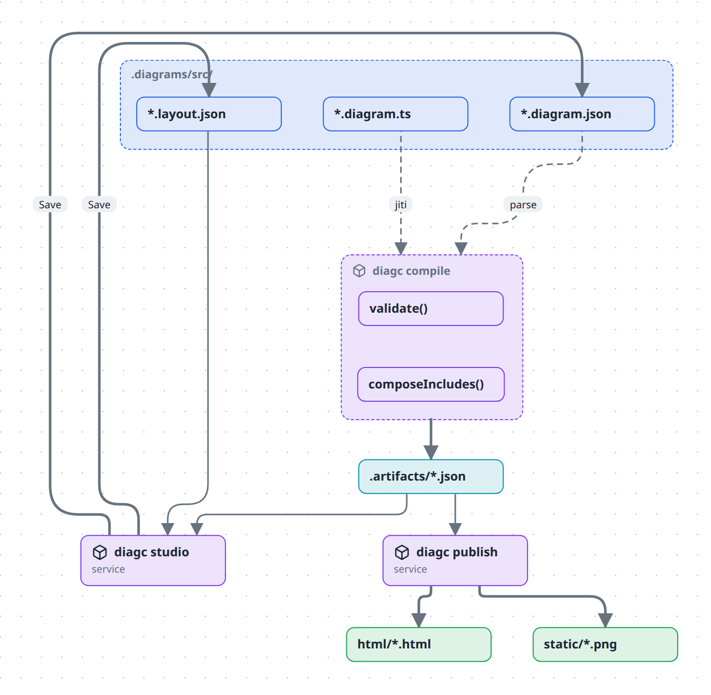
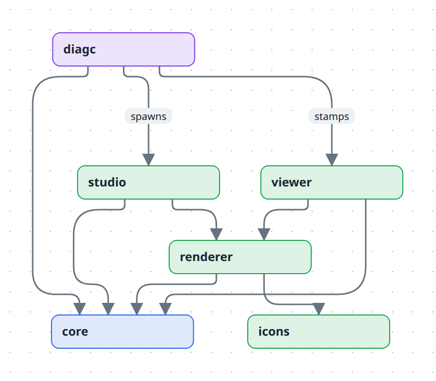

# diagc

This is an experimental tool.

Most diagram tools do one of two things. They turn code into a static picture, or they give you a canvas and good-looking shapes. This one is about the structure of a system: what sits inside what, and what you can add on top. It is still written and generated as code.

The goals of the project:

- Diagrams as code, in a form an AI can write
- Diagrams with levels, so you can start from the big picture and open up the parts you care about
- Transparent sheets ("layers") to add extra detail to any level without cluttering the base picture
- "Planes" to group the same things in more than one way, by system in one view and by where they run in another
- Combine diagrams from multiple sources together, so each system's diagram can be shown in context of other systems without copy-paste

Non-goals:

- Not a shared whiteboard. It runs on your machine against your files. No accounts, no server, no two people editing at once. 
- It does not simulate anything.
- It does not read your code.

Author diagrams as TypeScript, compile them to a validated JSON model, and explore them in a browser studio with **semantic zoom** — the diagram rests as folded group boxes whose relations aggregate; double-click a group to zoom into it and unfold its parts, double-click again to fold it back.

Diagrams are code, so they diff, review, and refactor like the rest of your repo.

You author diagrams two ways that meet at the same validated model: write a `.diagram.ts` file, or draw one in the browser and the studio writes a `.diagram.json` for you. Either way `diagc` compiles and validates it into one artifact per diagram, which the studio renders and `diagc publish` turns into shareable pages and images.



## Install

To use the tool on your own repo, install the CLI — no checkout needed:

```bash
npm i -g diagc                 # or: npx diagc studio
npm i -D @diagc/core     # optional: types for .diagram.ts authoring
```

`diagc studio` serves the editor against whatever directory you run it in. See the [`diagc` reference](docs/reference/cli.md).

## Quickstart (this repo)

Needs **Node ≥ 22** (the repo pins Node 24 in `mise.toml`) and **pnpm 10** (`corepack enable` once).

```bash
pnpm install
pnpm dev          # compile watcher + studio at http://localhost:5173
```

The repo ships an example, `.diagrams/src/examples/acme.diagram.ts`, so a fresh clone renders something immediately.

New here? Start with **[Tutorial 1 — Your first diagram](docs/tutorials/01-your-first-diagram.md)**.

## Documentation

Organised along [Diátaxis](https://diataxis.fr/) lines — learning, tasks, lookup, understanding.

**[Examples](docs/examples/README.md)** — every diagram type and feature with its source, each one also [live and zoomable](https://ferroman.github.io/diagc/).

### Tutorials — learn by doing

| | |
| --- | --- |
| [Your first diagram](docs/tutorials/01-your-first-diagram.md) | Zero to a compiled, rendered, exported diagram in TypeScript. |
| [Draw one in the browser](docs/tutorials/02-draw-in-the-studio.md) | The same result by dragging AWS icons onto a canvas. |

### How-to guides — get something done

| | |
| --- | --- |
| [Author diagrams in TypeScript](docs/how-to/author-in-typescript.md) | Nodes, relations, styles, ER tables, metadata. |
| [Use planes and layers](docs/how-to/use-planes-and-layers.md) | One model, several views: a second hierarchy, or an overlay. |
| [Add a legend](docs/how-to/add-a-legend.md) | An on-canvas key: derived rows, plus what only you can say. |
| [Organise a large diagram](docs/how-to/organise-large-diagrams.md) | Semantic zoom, pins, drilling — and when to split instead. |
| [Use the icon library](docs/how-to/use-the-icon-library.md) | C4 stencils, 763 AWS icons, importing your own. |
| [Draw on a diagram](docs/how-to/draw-on-a-diagram.md) | Freehand pen and eraser on top of the boxes. |
| [Draw a git branching diagram](docs/how-to/draw-a-git-branching-diagram.md) | Lanes of commits with branch-offs and merges, from the DSL or the studio. |
| [Draw an activity diagram](docs/how-to/draw-an-activity-diagram.md) | Swimlanes, forks and joins, decisions, signals and interrupts. |
| [Draw a C4 diagram](docs/how-to/draw-a-c4-diagram.md) | Solid person/system/container/component fills, and a technology subtitle. |
| [Draw a second-order thinking diagram](docs/how-to/draw-a-second-order-thinking-diagram.md) | A decision, its consequences, and what follows from those — banded by order. |
| [Draw a fishbone diagram](docs/how-to/draw-a-fishbone-diagram.md) | An effect, the categories of cause, causes and sub-causes on their bones. |
| [Draw a threat model](docs/how-to/draw-a-threat-model.md) | A STRIDE data-flow diagram whose elements and flows carry their own threat register. |
| [Compose diagrams](docs/how-to/compose-diagrams.md) | `include` and `key`: umbrella views over several diagrams. |
| [Publish and share](docs/how-to/publish-and-share.md) | PNGs for a README, interactive pages, GitHub Pages. |
| [Eject a diagram to TypeScript](docs/how-to/eject-to-typescript.md) | Promote a studio-drawn diagram to a verified, generated `.diagram.ts`. |
| [Place boxes on a generated diagram](docs/how-to/position-a-generated-diagram.md) | Position a read-only `.diagram.ts` view without losing it on re-compile. |
| [Change keyboard shortcuts](docs/how-to/change-keyboard-shortcuts.md) | Give any studio action its own key, a second key, or none. |
| [Set up `diagc` in another repo](docs/how-to/set-up-in-another-repo.md) | Use the CLI anywhere on your machine. |
| [Use the Obsidian plugin](docs/how-to/obsidian-plugin.md) | Studio pane, diagram embeds and node-to-note links in a vault. |

### Reference — look it up

| | |
| --- | --- |
| [`diagc` CLI](docs/reference/cli.md) | Commands, flags, environment variables, which files to commit. |
| [Model](docs/reference/model.md) | Every field of a diagram, every validation code, registry defaults. |
| [Builder API](docs/reference/builder-api.md) | The TypeScript DSL, method by method. |
| [Studio](docs/reference/studio.md) | Panels, gestures, shortcuts. |
| [Library](docs/reference/library.md) | The bundled C4, Tech and AWS packs. |

### Explanation — understand it

| | |
| --- | --- |
| [How a diagram becomes a picture](docs/explanation/architecture.md) | The pipeline, the packages, and why they are split that way. |
| [What is in a model](docs/explanation/the-model.md) | The five decisions frozen into the data structure. |
| [What you see is not what is stored](docs/explanation/views.md) | Semantic zoom, planes and layers — and how they interact. |

## Extending the renderer

The renderer is driven by three registries and a theme, all overridable. The studio uses the built-in defaults; these hooks apply when you render `DiagramView` yourself.

```tsx
import { createIconRegistry } from '@diagc/icons';
import { createTypeRegistry, createKindRegistry, DiagramView } from '@diagc/renderer';

const typeRegistry = createTypeRegistry({ lambda: { shape: 'hexagon', icon: 'lambda', dashed: true } });
const kindRegistry = createKindRegistry({ grpc: { animated: true, width: 2 } });
const icons = createIconRegistry({ lambda: MyLambdaIcon });

<DiagramView model={model} typeRegistry={typeRegistry} kindRegistry={kindRegistry} icons={icons} />;
```

Overrides merge over the defaults, so you declare only what is new; unknown types fall back to a plain box and unknown kinds to a plain line. `registry.register(id, style)` adds entries imperatively.

Colours are a flat [`ThemeTokens`](./packages/renderer/src/theme.ts) object exposed to CSS as `--dg-*` custom properties. Start from `lightTheme` / `darkTheme` and apply a tweaked copy with `applyTheme(el, theme)`.

## Development

```bash
pnpm dev         # compile:watch + studio together
pnpm test        # vitest
pnpm typecheck   # tsc --noEmit across every package
```



| Path | Package | Role |
| --- | --- | --- |
| `packages/core` | `@diagc/core` | Builder DSL, the JSON model + validation, the view compiler. **Published.** |
| `packages/renderer` | `@diagc/renderer` | React `DiagramView` (React Flow + elk) and the type/kind/theme registries. |
| `packages/icons` | `@diagc/icons` | Icon id → lucide component. |
| `packages/diagc` | `diagc` | The `diagc` CLI: compile, watch, publish, studio. **Published.** |
| `apps/studio` | `@diagc/studio` | The browser app and its dev-server API. |
| `apps/viewer` | `@diagc/viewer` | The single-file shell `publish` stamps a model into. |

The diagrams in these docs are built with this tool — sources in `.diagrams/src/docs-*.diagram.ts`, regenerated with `pnpm publish-diagrams`.

### Releasing

`diagc` and `@diagc/core` are published together and share a version. The other packages are build inputs: `renderer`, `icons`, `studio`, and `viewer` are baked into what `diagc` ships and stay private.

```bash
pnpm build:dist                       # compile both packages, build viewer + studio, stage assets
pnpm --filter @diagc/core pack  # inspect the tarballs before trusting them
pnpm --filter diagc pack
pnpm -r publish --access public       # requires `npm adduser` first
```

Use **pnpm**, not `npm publish` — the published manifests rely on pnpm rewriting `publishConfig` (source `exports` become `dist` ones) and turning `workspace:*` into a real version. `prepack` rebuilds everything, so a stale `dist/` cannot ship.

What an installed CLI carries that a checkout does not: `packages/diagc/assets/` holds the prebuilt viewer shell and studio bundle, and `diagc studio` serves that bundle from its own http server instead of spawning Vite. Both layouts are resolved in `packages/diagc/src/home.ts`.

## Contributing

Contributions are welcome. Because this project is dual-licensed — AGPL-3.0 for
everyone, plus commercial licenses for those who need different terms — every
contributor signs a [CLA](CLA.md) before their first pull request is merged, granting
the right to relicense their contribution. A bot handles this on the PR; see
[CONTRIBUTING.md](CONTRIBUTING.md) for the details and the reasoning.

Found a security problem? Please report it privately — see [SECURITY.md](SECURITY.md).

## License

Licensed under the **[GNU Affero General Public License, version 3](LICENSE)**
(`AGPL-3.0-only`), with additional permissions under section 7.

Plainly, what that means:

- **Using it is unrestricted.** Run it locally, or host it inside your company for your
  colleagues, commercially or otherwise. You owe nothing and need not publish anything.
- **Your diagrams are yours.** Diagram sources you author, and the artifacts, images and
  pages built from them, are not covered by the AGPL — license them however you like.
  That is what the section 7 additional permissions grant.
- **Modifying and redistributing it, or offering a modified version to others over a
  network, means publishing your source** under the same license. This is the part that
  matters: someone cannot take this, improve it privately, and resell it as a closed
  service.

Published HTML pages embed the viewer, which stays AGPL — so each page carries a
comment pointing at this repository, which satisfies the source offer for an
unmodified copy. Nothing is required of you beyond leaving it in place.

Third-party components bundled into the published CLI are listed in
[THIRD-PARTY-NOTICES.md](THIRD-PARTY-NOTICES.md).

### Commercial licensing

If the AGPL does not suit you — you want to embed this in a proprietary product, or
offer it to third parties as a hosted service, without releasing your own source — a
separate commercial license is available. Contact <bfrankovskyi@gmail.com>.
