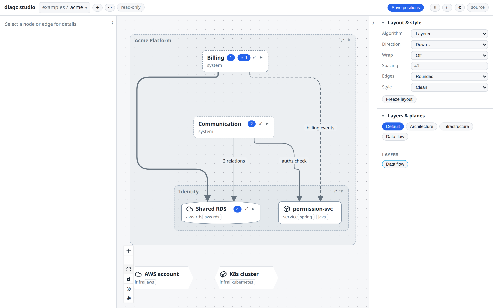

# diagc

Diagrams as code, with a local studio. diagc turns diagram sources that live in your repository into things other people can open.

- **Pages and pictures.** `diagc publish` writes one self-contained HTML page per diagram, and a PNG. The page folds, zooms and switches views in the browser, with no server behind it. Host the pages on GitHub Pages, GitLab Pages or any static host, and put the PNG in a README.
- **Diffs in pull requests.** A GitHub Action comments on a pull request that changes a diagram: the list of changes, and the before and after pictures.
- **A local studio.** `diagc studio` opens a browser app against your repository. Draw a diagram there and the studio saves it as a file in the repository. `diagc eject` turns a drawn diagram into TypeScript.

[](https://ferroman.github.io/diagc/)

**[Website](https://ferroman.github.io/diagc/)** · **[Live examples](https://ferroman.github.io/diagc/html/index.html)** · **[Documentation](docs/README.md)**

You author a diagram in one of two ways, and both meet at the same validated model. Write a `.diagram.ts` file, or draw in the studio and it writes a `.diagram.json` for you. Either way `diagc` compiles and validates it into one artifact per diagram, which the studio renders and `diagc publish` turns into pages and pictures.

## Features

Most diagram tools do one of two things. They turn code into a static picture, or they give you a canvas and good-looking shapes. This one is about the structure of a system: what sits inside what, and what you can add on top. It is still written and generated as code.

- **Diagrams as code.** A diagram is a TypeScript file, so it diffs, reviews and refactors like the rest of your repository. `diagc` validates it when it compiles, and `diagc lint` reports what compiles but is probably a mistake. See [Author diagrams in TypeScript](docs/how-to/author-in-typescript.md).
- **Code generation.** Draw a diagram in the studio, then eject it. `diagc eject`, or **Eject** in the studio, replaces the drawn `.diagram.json` with a generated `.diagram.ts`, and checks first that the generated source rebuilds exactly the same model. See [Eject a diagram to TypeScript](docs/how-to/eject-to-typescript.md).
- **AI-written diagrams.** Ask a coding agent such as Claude Code, Codex or Cursor for a diagram, and it writes the source and checks its own work. `diagc guide` prints how to write a diagram in a form an AI can read, and `diagc init --agents` points coding agents at it. A model with no shell reads the same guide as one file, [llms.txt](https://ferroman.github.io/diagc/llms.txt). See [Write diagrams with a coding agent](docs/how-to/write-diagrams-with-a-coding-agent.md).
- **Semantic zoom.** A diagram rests as folded group boxes whose relations aggregate, so you start from the big picture. Double-click a group to zoom into it and unfold its parts. Double-click again to fold it back. See [Organise a large diagram](docs/how-to/organise-large-diagrams.md).
- **Planes and layers.** A plane groups the same things in a second way: by system in one view, by where they run in another. A layer is a transparent sheet that adds detail to any level without cluttering the base picture. See [Use planes and layers](docs/how-to/use-planes-and-layers.md).
- **Composition.** `include` combines diagrams from several sources, so each system's diagram appears in the context of the other systems without copy-paste. See [Compose diagrams](docs/how-to/compose-diagrams.md).
- **Multiple diagram types.** [C4](docs/how-to/draw-a-c4-diagram.md), [deployment](docs/how-to/draw-a-deployment-diagram.md), [ER](docs/how-to/draw-an-er-diagram.md), [activity](docs/how-to/draw-an-activity-diagram.md), [threat model](docs/how-to/draw-a-threat-model.md), [causal loop](docs/how-to/draw-a-causal-loop-diagram.md), [plan](docs/how-to/draw-a-plan.md), [fishbone](docs/how-to/draw-a-fishbone-diagram.md), [git graph](docs/how-to/draw-a-git-branching-diagram.md) and [second-order thinking](docs/how-to/draw-a-second-order-thinking-diagram.md).
- **Icon libraries.** C4 stencils and the AWS, Azure, Google Cloud, Kubernetes and tech icon sets. See [Use the icon library](docs/how-to/use-the-icon-library.md).
- **Diffs for review.** `diagc diff` draws what changed in the diagrams between two git refs, and a GitHub Action puts the pictures on a pull request. See [Show what changed](docs/how-to/show-what-changed.md).
- **Notes on the picture.** [A legend](docs/how-to/add-a-legend.md), [comments and links](docs/how-to/comment-on-a-diagram.md) on any node or relation, and [freehand drawing](docs/how-to/draw-on-a-diagram.md).
- **Obsidian.** A plugin puts the studio and diagram embeds in a vault. It is built from a checkout of this repository, not installed with the CLI. See [Use the Obsidian plugin](docs/how-to/obsidian-plugin.md).

## Install

One line, no Node required (macOS and Linux):

```bash
curl -fsSL https://raw.githubusercontent.com/Ferroman/diagc/main/install.sh | sh
```

It installs into `~/.local/share/diagc` with a `diagc` launcher in `~/.local/bin`, using your Node if it is 22 or newer and downloading its own otherwise. Run it again to update. With Node already set up, `npm i -g @diagc/cli` works too, and `npx @diagc/cli <command>` needs no install at all.

Then, in any repository:

```bash
diagc init shop     # a starter diagram in .diagrams/src/, the .gitignore lines, compiled
diagc studio        # look at it — recompiles as you edit
```

No checkout, no pnpm, nothing installed into your project. `diagc guide` prints how to write a diagram, for you or for a coding agent (`diagc init --agents` points agents at it); `npm i -D @diagc/core` is optional, for types in the editor.

New here? Start with **[Tutorial 1 — Your first diagram](docs/tutorials/01-your-first-diagram.md)**. Every command is in the [`diagc` reference](docs/reference/cli.md).

## Documentation

The documentation follows [Diátaxis](https://diataxis.fr/). The full index is [docs/README.md](docs/README.md).

- **[Tutorials](docs/README.md#tutorials)** teach by doing. Start with [Your first diagram](docs/tutorials/01-your-first-diagram.md).
- **[How-to guides](docs/README.md#how-to-guides)** each get one task done, from authoring to publishing.
- **[Reference](docs/README.md#reference)** is for lookup: the [`diagc` CLI](docs/reference/cli.md), the model, the builder API and the studio.
- **[Explanation](docs/README.md#explanation)** gives the reasons behind the design.
- **[Examples](docs/examples/README.md)** show every diagram type and feature with its source. Each one is also live and zoomable.

## Status, and what it is not

This is an experimental tool.

- It is not a shared whiteboard. It runs on your machine against your files. No accounts, no server, no two people editing at once.
- It does not simulate anything.
- It does not read your code.

## Contributing

Contributions are welcome. Because this project is dual-licensed — AGPL-3.0 for
everyone, plus commercial licenses for those who need different terms — every
contributor signs a [CLA](CLA.md) before their first pull request is merged, granting
the right to relicense their contribution. A bot handles this on the PR; see
[CONTRIBUTING.md](CONTRIBUTING.md) for the details and the reasoning. Setup, the packages
and the release process are there too.

Found a security problem? Please report it privately — see [SECURITY.md](SECURITY.md).

## License

Licensed under the **[GNU Affero General Public License, version 3](LICENSE)**
(`AGPL-3.0-only`), with additional permissions under section 7.

Plainly, what that means:

- **Using it is unrestricted.** Run it locally, or host it inside your company for your
  colleagues, commercially or otherwise. You owe nothing and need not publish anything.
- **Your diagrams are yours.** Diagram sources you author, and the artifacts, images and
  pages built from them, are not covered by the AGPL — license them however you like.
  That is what the section 7 additional permissions grant.
- **Modifying and redistributing it, or offering a modified version to others over a
  network, means publishing your source** under the same license. This is the part that
  matters: someone cannot take this, improve it privately, and resell it as a closed
  service.

Published HTML pages embed the viewer, which stays AGPL — so each page carries a
comment pointing at this repository, which satisfies the source offer for an
unmodified copy. Nothing is required of you beyond leaving it in place.

Third-party components bundled into the published CLI are listed in
[THIRD-PARTY-NOTICES.md](THIRD-PARTY-NOTICES.md).

### Commercial licensing

If the AGPL does not suit you — you want to embed this in a proprietary product, or
offer it to third parties as a hosted service, without releasing your own source — a
separate commercial license is available. Contact <bfrankovskyi@gmail.com>.
