# Examples

Every diagram here is built by `diagc` from a source in this repository. Click an image to open the live page: it folds, drills and switches planes the way the PNG cannot. **Source** is the file to copy from; **Guide** is the page that explains it.

To open them in the studio instead, run `pnpm dev` in a clone and pick one from the diagram picker — they are grouped by the same folders.

- [Diagram types](#diagram-types)
- [Architecture](#architecture)
- [Features](#features)
- [The docs' own figures](#the-docs-own-figures)

## Diagram types

Each type has a **starter** — the smallest file worth copying, shown whole in its guide — and a realistic example. Where a guide walks through a figure of its own, that figure comes first.

### C4

[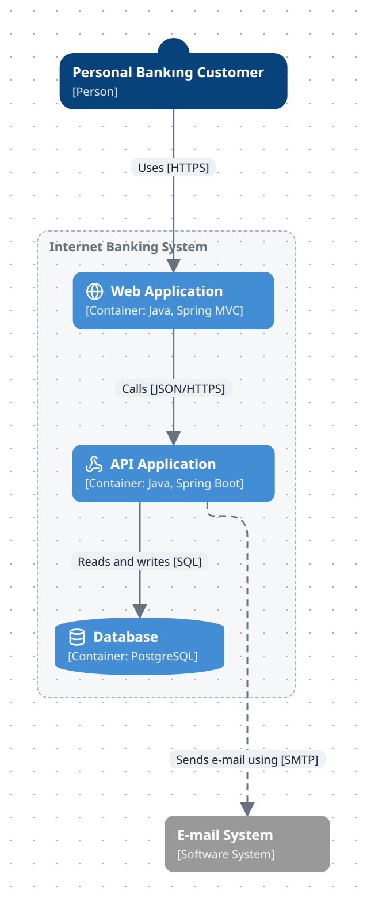](https://ferroman.github.io/diagc/html/docs/c4.html)

The canonical C4 picture, kept small: a person and two systems at context level, with the primary system's containers one drill below — solid fills per element kind and a technology subtitle, from `m.notation('c4')`.
[Live](https://ferroman.github.io/diagc/html/docs/c4.html) · [Source](../../.diagrams/src/docs/c4.diagram.ts) · [Guide](../how-to/draw-a-c4-diagram.md)

#### Starter: expense claims

[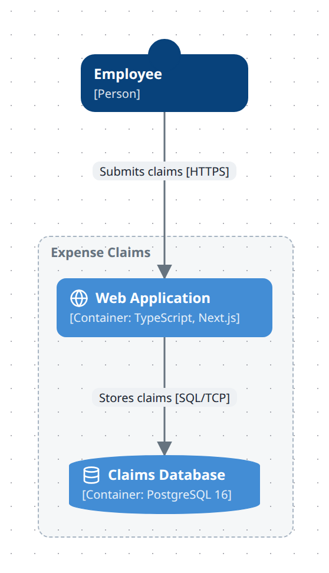](https://ferroman.github.io/diagc/html/examples/c4/starter.html)

An employee, one system and its two containers — the smallest diagram that still shows the C4 fills, the `[Container: technology]` subtitles and labelled relations.
[Live](https://ferroman.github.io/diagc/html/examples/c4/starter.html) · [Source](../../.diagrams/src/examples/c4/starter.diagram.ts) · [Guide](../how-to/draw-a-c4-diagram.md)

#### Online bookstore

[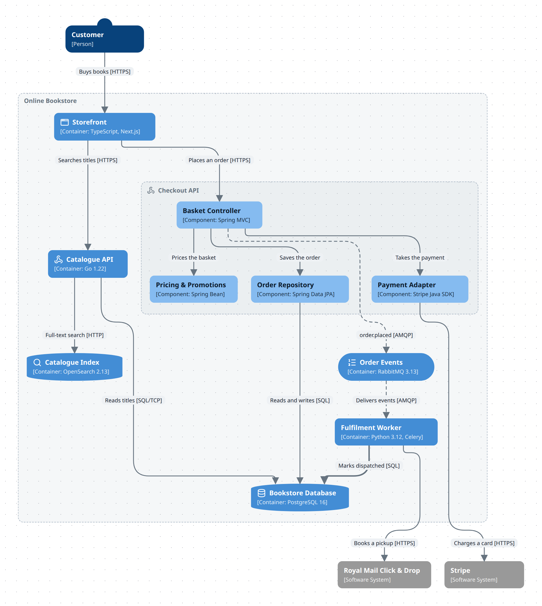](https://ferroman.github.io/diagc/html/examples/c4/online-bookstore.html)

A bookstore at all three C4 levels in one model: a customer and two external systems at context level, seven containers inside the shop — a database, a queue and a search index among them — and the Checkout API's components one drill further down.
[Live](https://ferroman.github.io/diagc/html/examples/c4/online-bookstore.html) · [Source](../../.diagrams/src/examples/c4/online-bookstore.diagram.ts) · [Guide](../how-to/draw-a-c4-diagram.md)

### Activity

[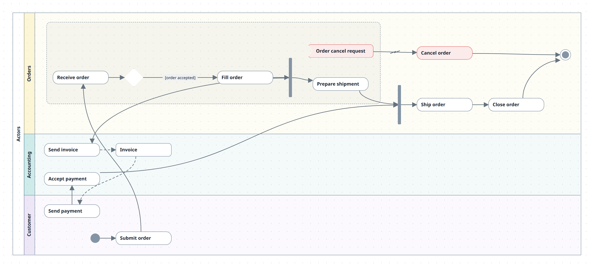](https://ferroman.github.io/diagc/html/docs/activity.html)

Order processing across three swimlanes: a decision, a fork and join, an object flow, and an interruptible region that a received signal cuts short — `m.activity()` with `lane`, `region`, `flow`, `objectFlow` and `interrupt`.
[Live](https://ferroman.github.io/diagc/html/docs/activity.html) · [Source](../../.diagrams/src/docs/activity.diagram.ts) · [Guide](../how-to/draw-an-activity-diagram.md)

#### Starter: expense approval

[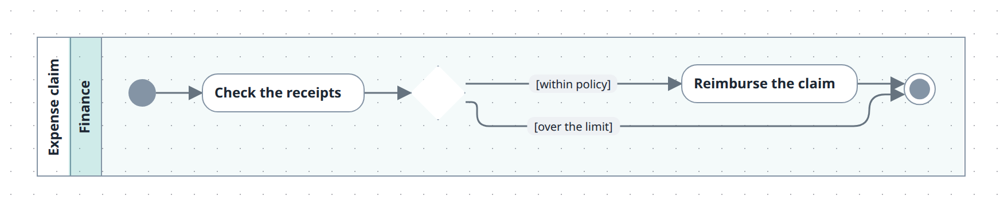](https://ferroman.github.io/diagc/html/examples/activity/starter.html)

One lane: a start, a check, a decision with two guards, and a final node — the smallest activity diagram that still branches.
[Live](https://ferroman.github.io/diagc/html/examples/activity/starter.html) · [Source](../../.diagrams/src/examples/activity/starter.diagram.ts) · [Guide](../how-to/draw-an-activity-diagram.md)

#### Order fulfilment

[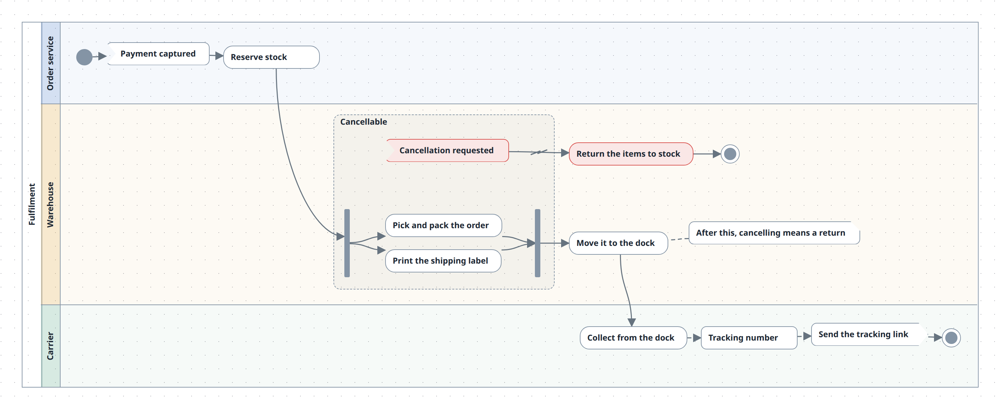](https://ferroman.github.io/diagc/html/examples/activity/order-fulfilment.html)

A paid order handed down three lanes to the carrier. An interruptible region holds the warehouse's fork and join, so a cancellation signal can cut the work short; the tracking number reaches the outgoing signal as an object flow; a note marks the point of no return. Placed by hand, so every hand-over reads left to right.
[Live](https://ferroman.github.io/diagc/html/examples/activity/order-fulfilment.html) · [Source](../../.diagrams/src/examples/activity/order-fulfilment.diagram.ts) · [Guide](../how-to/draw-an-activity-diagram.md)

### Git graph

[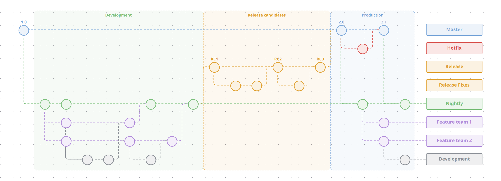](https://ferroman.github.io/diagc/html/docs/git-graph.html)

A branching strategy as lanes of commits: a release line, a hotfix, release candidates, a nightly integration lane and two feature teams, with tags, branch-offs and merges — `m.gitGraph()`.
[Live](https://ferroman.github.io/diagc/html/docs/git-graph.html) · [Source](../../.diagrams/src/docs/git-graph.diagram.ts) · [Guide](../how-to/draw-a-git-branching-diagram.md)

#### Starter: a feature branch

[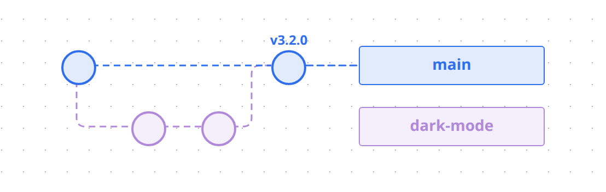](https://ferroman.github.io/diagc/html/examples/git-graph/starter.html)

A feature branch cut from `main`, two commits, and a tagged merge back.
[Live](https://ferroman.github.io/diagc/html/examples/git-graph/starter.html) · [Source](../../.diagrams/src/examples/git-graph/starter.diagram.ts) · [Guide](../how-to/draw-a-git-branching-diagram.md)

#### Courier app release train

[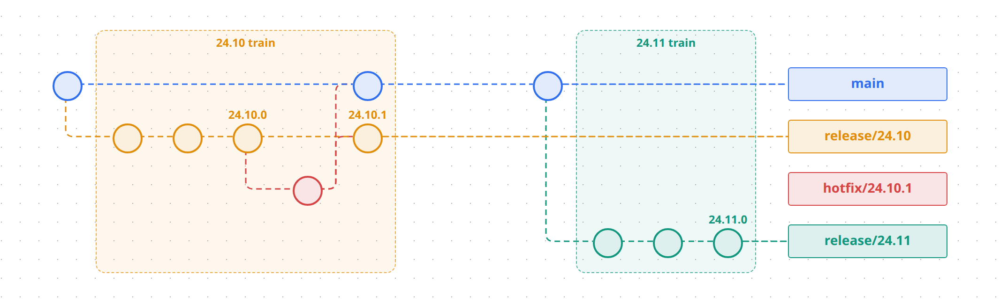](https://ferroman.github.io/diagc/html/examples/git-graph/release-train.html)

A trunk-based release train: two release branches cut from `main`, and a hotfix that lands on a shipped release and is backported to `main` before the next cut — `commit({ from })`, `merge`, a `gap`, two `stage` frames and a `color` per lane.
[Live](https://ferroman.github.io/diagc/html/examples/git-graph/release-train.html) · [Source](../../.diagrams/src/examples/git-graph/release-train.diagram.ts) · [Guide](../how-to/draw-a-git-branching-diagram.md)

### Fishbone

[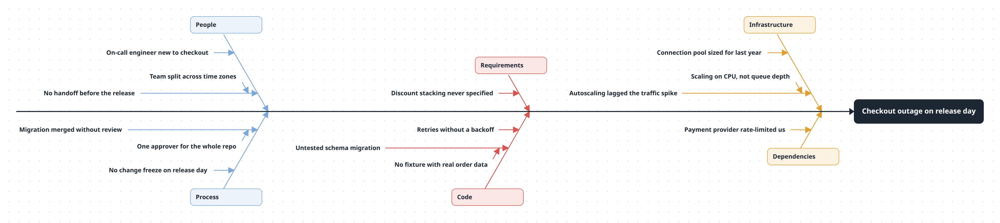](https://ferroman.github.io/diagc/html/docs/fishbone.html)

A postmortem's cause-and-effect fish: the six `Software` preset bones, with causes and sub-causes hung on them — `m.fishbone()` and `categories('Software')`.
[Live](https://ferroman.github.io/diagc/html/docs/fishbone.html) · [Source](../../.diagrams/src/docs/fishbone.diagram.ts) · [Guide](../how-to/draw-a-fishbone-diagram.md)

#### Starter: checkout outage

[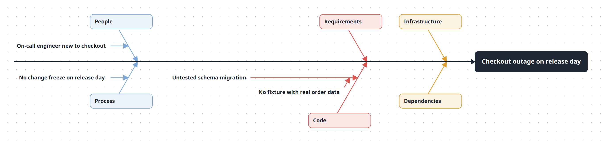](https://ferroman.github.io/diagc/html/examples/fishbone/starter.html)

The guide's own listing: the `Software` preset with causes on three of its six bones, one of them chained into a sub-cause.
[Live](https://ferroman.github.io/diagc/html/examples/fishbone/starter.html) · [Source](../../.diagrams/src/examples/fishbone/starter.diagram.ts) · [Guide](../how-to/draw-a-fishbone-diagram.md)

#### Checkout latency at peak

[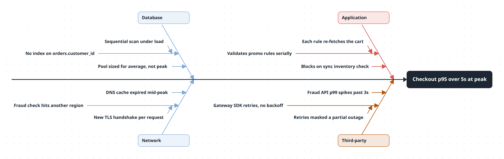](https://ferroman.github.io/diagc/html/examples/fishbone/checkout-latency.html)

A slow-checkout postmortem on four hand-made bones — Database, Network, Application, Third-party — with a sub-cause on every bone, `description`s, and a `color` on one category: `fb.category()` instead of a preset.
[Live](https://ferroman.github.io/diagc/html/examples/fishbone/checkout-latency.html) · [Source](../../.diagrams/src/examples/fishbone/checkout-latency.diagram.ts) · [Guide](../how-to/draw-a-fishbone-diagram.md)

### Second-order thinking

[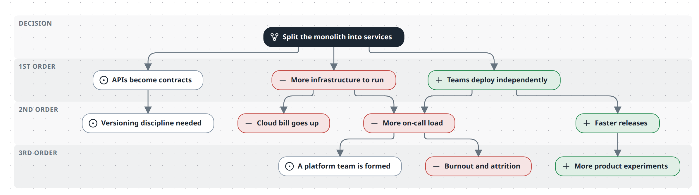](https://ferroman.github.io/diagc/html/docs/second-order.html)

One decision and what follows from it, banded by order: good, bad and neutral consequences, and two branches that join — `m.secondOrder()` with `then` and `leadsTo`.
[Live](https://ferroman.github.io/diagc/html/docs/second-order.html) · [Source](../../.diagrams/src/docs/second-order.diagram.ts) · [Guide](../how-to/draw-a-second-order-thinking-diagram.md)

#### Starter: requiring 2FA

[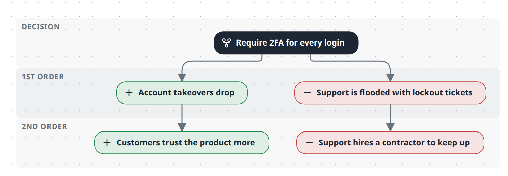](https://ferroman.github.io/diagc/html/examples/second-order/starter.html)

One decision with a good and a bad first-order consequence, each carried one step further.
[Live](https://ferroman.github.io/diagc/html/examples/second-order/starter.html) · [Source](../../.diagrams/src/examples/second-order/starter.diagram.ts) · [Guide](../how-to/draw-a-second-order-thinking-diagram.md)

#### Moving to a four-day work week

[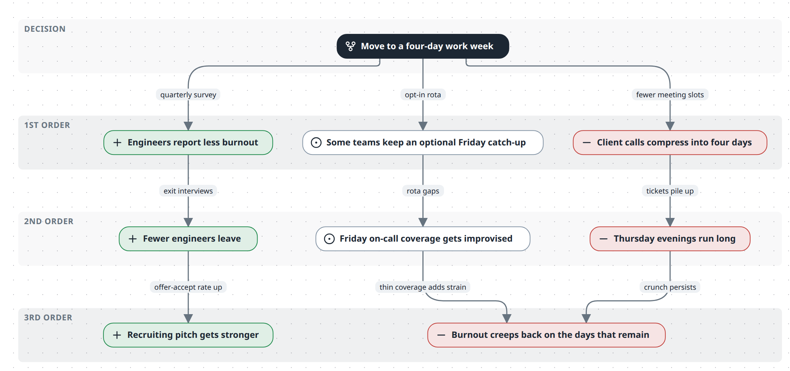](https://ferroman.github.io/diagc/html/examples/second-order/four-day-week.html)

A four-day-week proposal traced three orders out: good, bad and neutral consequences, labelled arrows, and two branches that `leadsTo` joins into the same burnout.
[Live](https://ferroman.github.io/diagc/html/examples/second-order/four-day-week.html) · [Source](../../.diagrams/src/examples/second-order/four-day-week.diagram.ts) · [Guide](../how-to/draw-a-second-order-thinking-diagram.md)

### Threat model

[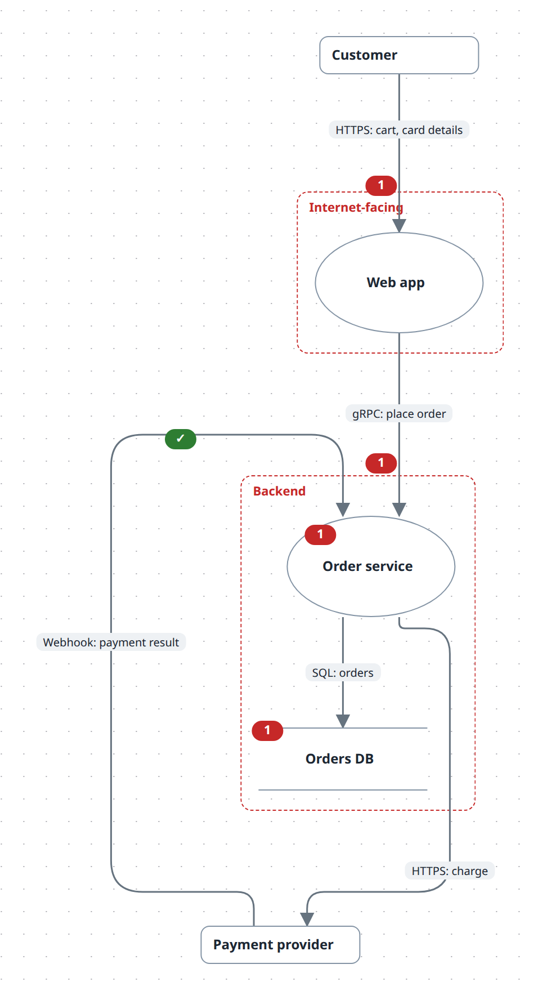](https://ferroman.github.io/diagc/html/docs/threat-model.html)

A STRIDE data-flow diagram of a checkout: entities, processes and a store inside two trust boundaries, with seven threats recorded on the elements and flows they belong to. The live page lists them in a register under the canvas — `m.threatModel()`.
[Live](https://ferroman.github.io/diagc/html/docs/threat-model.html) · [Source](../../.diagrams/src/docs/threat-model.diagram.ts) · [Guide](../how-to/draw-a-threat-model.md)

#### Starter: password reset

[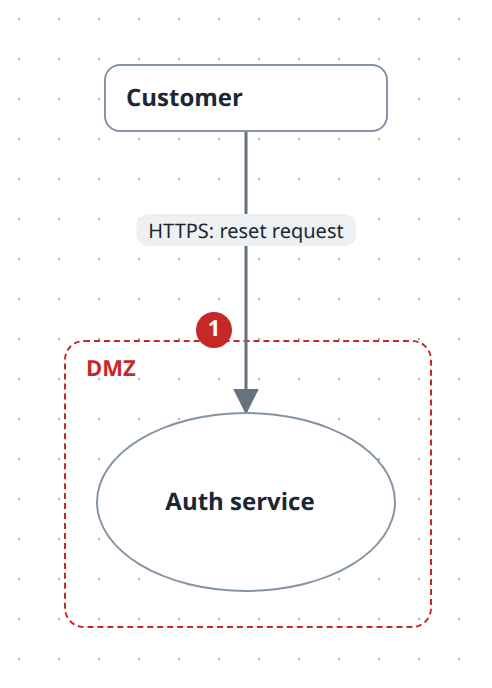](https://ferroman.github.io/diagc/html/examples/threat-model/starter.html)

A customer, an auth service inside one trust boundary, and one information-disclosure threat on the flow between them.
[Live](https://ferroman.github.io/diagc/html/examples/threat-model/starter.html) · [Source](../../.diagrams/src/examples/threat-model/starter.diagram.ts) · [Guide](../how-to/draw-a-threat-model.md)

#### Payments API

[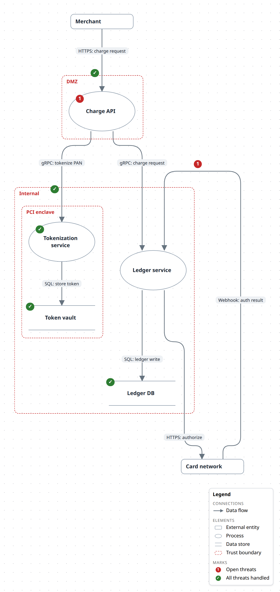](https://ferroman.github.io/diagc/html/examples/threat-model/payments-api.html)

A charge API that tokenizes cards in a PCI enclave nested inside the internal boundary, writes to a ledger and settles with a card network — seven threats across elements and flows, open, mitigated and accepted.
[Live](https://ferroman.github.io/diagc/html/examples/threat-model/payments-api.html) · [Source](../../.diagrams/src/examples/threat-model/payments-api.diagram.ts) · [Guide](../how-to/draw-a-threat-model.md)

### ER

#### Starter: library loans

[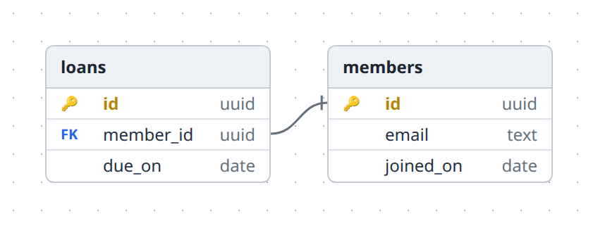](https://ferroman.github.io/diagc/html/examples/er/starter.html)

Two tables and the foreign key between them — the smallest ER diagram there is.
[Live](https://ferroman.github.io/diagc/html/examples/er/starter.html) · [Source](../../.diagrams/src/examples/er/starter.diagram.ts) · [Guide](../how-to/draw-an-er-diagram.md)

#### Shop schema

[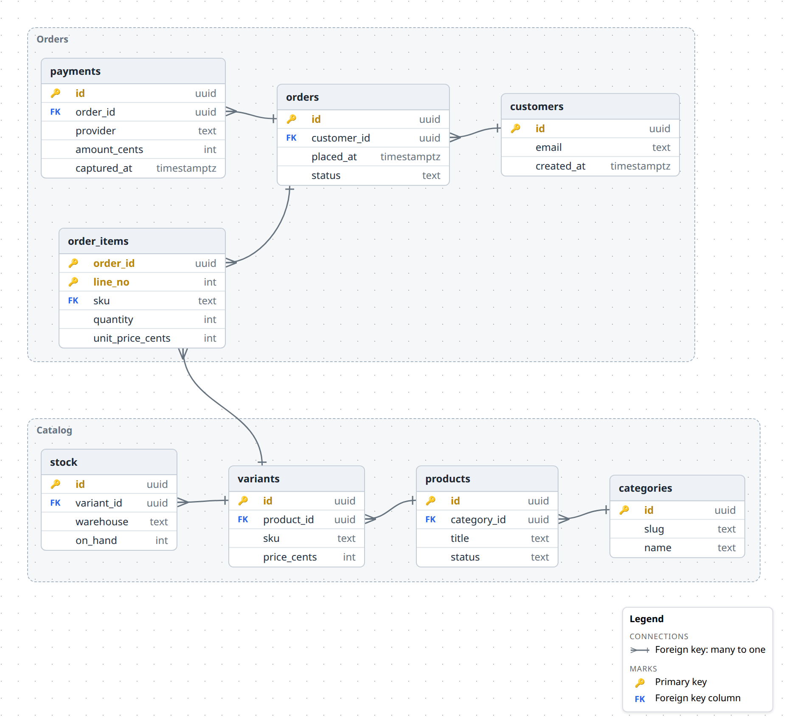](https://ferroman.github.io/diagc/html/examples/er/shop-schema.html)

A shop's eight tables in a catalog half and an orders half: a composite primary key on the order lines, and one foreign key that names the column it points at instead of resolving to a primary key — `m.table()` and `m.fk()`.
[Live](https://ferroman.github.io/diagc/html/examples/er/shop-schema.html) · [Source](../../.diagrams/src/examples/er/shop-schema.diagram.ts) · [Guide](../how-to/draw-an-er-diagram.md)

### Causal loop

#### Starter: word-of-mouth growth

[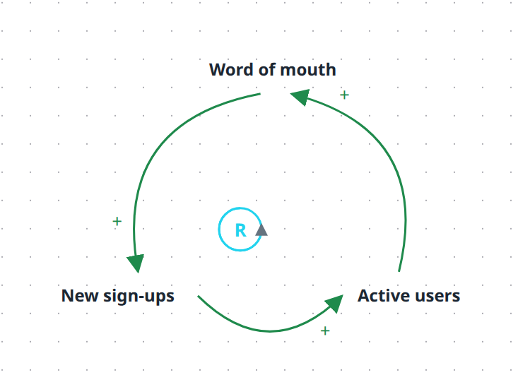](https://ferroman.github.io/diagc/html/examples/causal-loop/starter.html)

Three variables in one reinforcing loop: every link is `+`, so the loop is badged R.
[Live](https://ferroman.github.io/diagc/html/examples/causal-loop/starter.html) · [Source](../../.diagrams/src/examples/causal-loop/starter.diagram.ts) · [Guide](../how-to/draw-a-causal-loop-diagram.md)

#### Technical debt: the shortcut spiral

[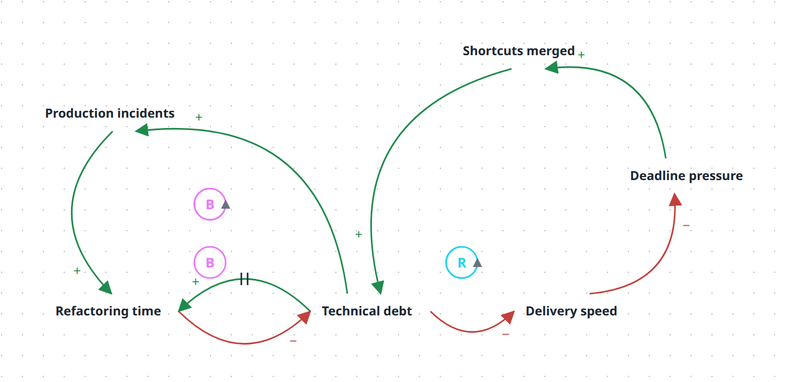](https://ferroman.github.io/diagc/html/examples/causal-loop/tech-debt.html)

Why shortcuts feed on themselves: a reinforcing loop through delivery speed and deadline pressure, and two balancing loops through refactoring, one of them delayed. The R and B badges are derived from the links' polarities — `m.notation('causal-loop')` and plain `m.relate()`.
[Live](https://ferroman.github.io/diagc/html/examples/causal-loop/tech-debt.html) · [Source](../../.diagrams/src/examples/causal-loop/tech-debt.diagram.ts) · [Guide](../how-to/draw-a-causal-loop-diagram.md)

## Architecture

### Acme SaaS

[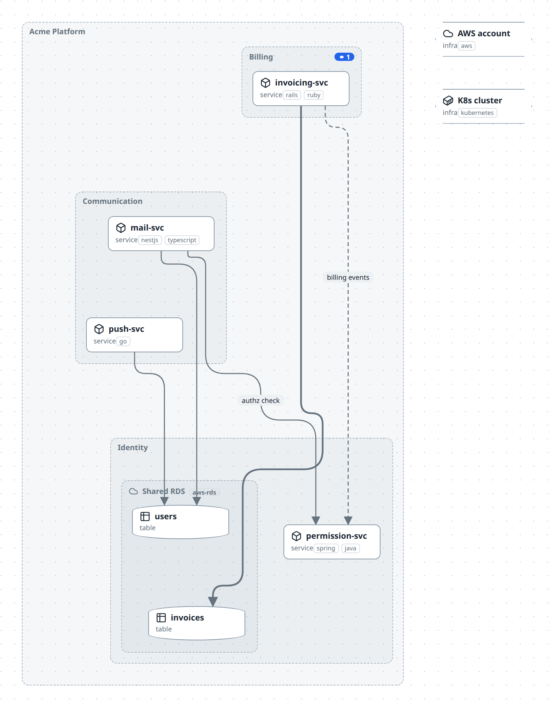](https://ferroman.github.io/diagc/html/examples/acme.html)

A small platform seen three ways over the same services: an architecture plane of who owns what, an infra plane of where it runs, and a flow plane that shows only the data-flow layer — plus icons and node metadata. The image shows the first plane; the live page switches between them.
[Live](https://ferroman.github.io/diagc/html/examples/acme.html) · [Source](../../.diagrams/src/examples/acme.diagram.ts) · [Guide](../how-to/author-in-typescript.md)

### Multi-AZ EKS on AWS

[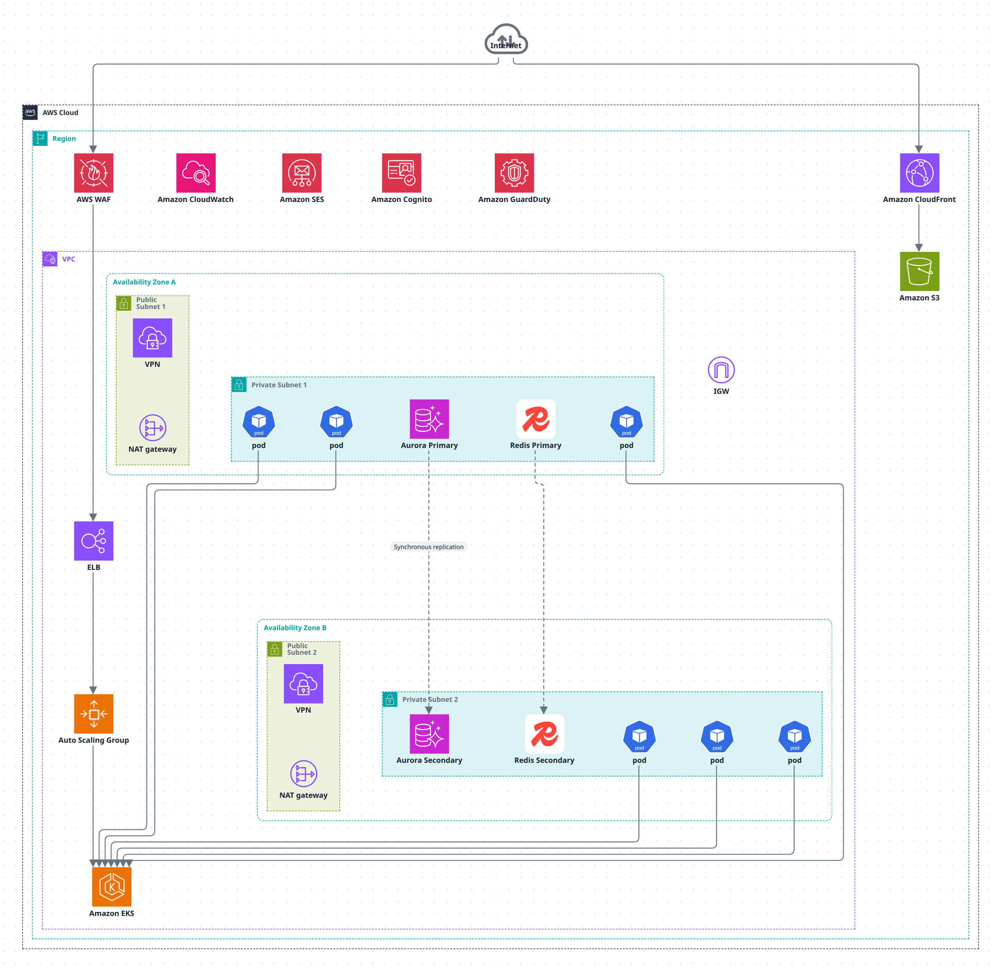](https://ferroman.github.io/diagc/html/examples/aws-multi-az.html)

A classic AWS reference architecture drawn with the bundled library: `aws-*` boundary containers with corner badges, official service icons, Kubernetes pod icons and tech-pack logos, all as `image` asset refs.
[Live](https://ferroman.github.io/diagc/html/examples/aws-multi-az.html) · [Source](../../.diagrams/src/examples/aws-multi-az.diagram.ts) · [Guide](../how-to/use-the-icon-library.md)

## Features

### Semantic zoom

[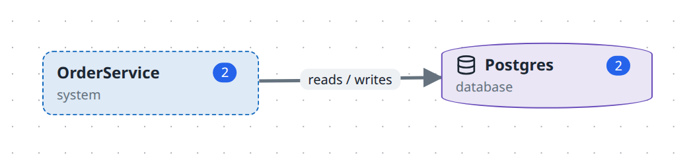](https://ferroman.github.io/diagc/html/examples/nested-zoom-demo.html)

Everything rests folded: two groups, each showing how many children it holds, and the three relations between their contents drawn as one aggregated arrow. Open the live page and double-click a group to unfold it.
[Live](https://ferroman.github.io/diagc/html/examples/nested-zoom-demo.html) · [Source](../../.diagrams/src/examples/nested-zoom-demo.diagram.json) · [Guide](../how-to/organise-large-diagrams.md)

### Planes

[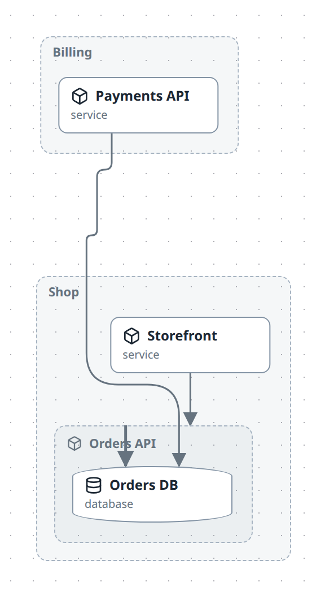](https://ferroman.github.io/diagc/html/docs/plane-architecture.html)
[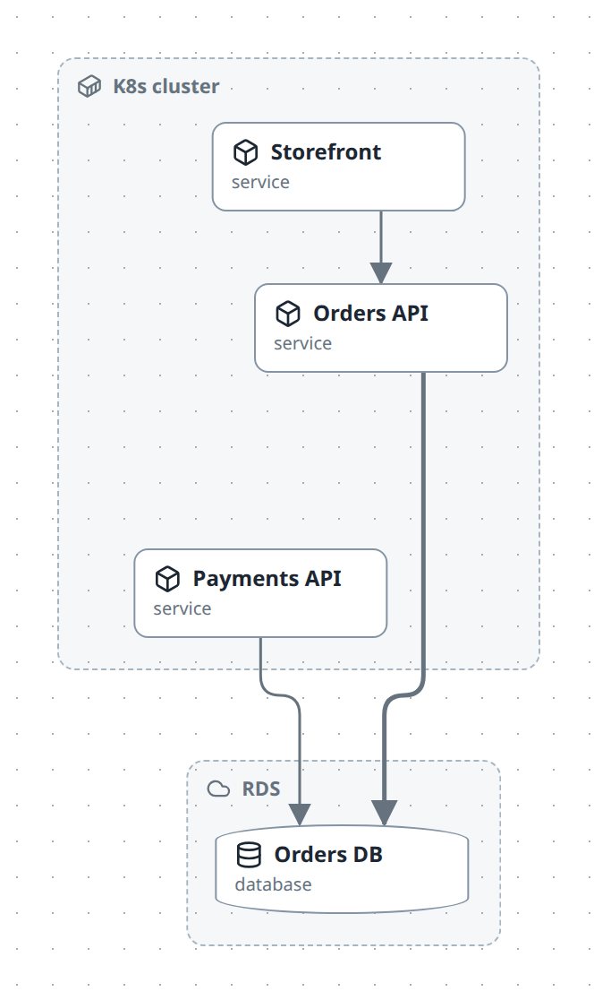](https://ferroman.github.io/diagc/html/docs/plane-infra.html)
[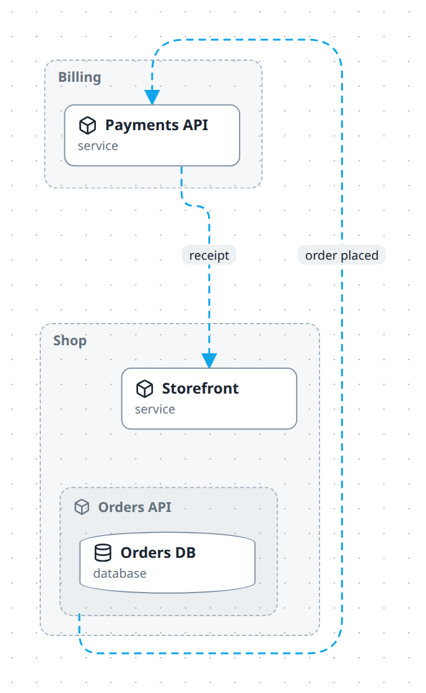](https://ferroman.github.io/diagc/html/docs/plane-flow.html)

One model, three hierarchies over the same nodes: who owns what, where it runs, and a flow view that borrows the first plane's structure, presets a layer and drops the ordinary arrows. Three thin files share one module and differ only in which plane comes first.
[Live](https://ferroman.github.io/diagc/html/docs/plane-architecture.html) · [Source](../../.diagrams/src/docs/planes.shared.ts) · [Guide](../how-to/use-planes-and-layers.md)

### Legend

[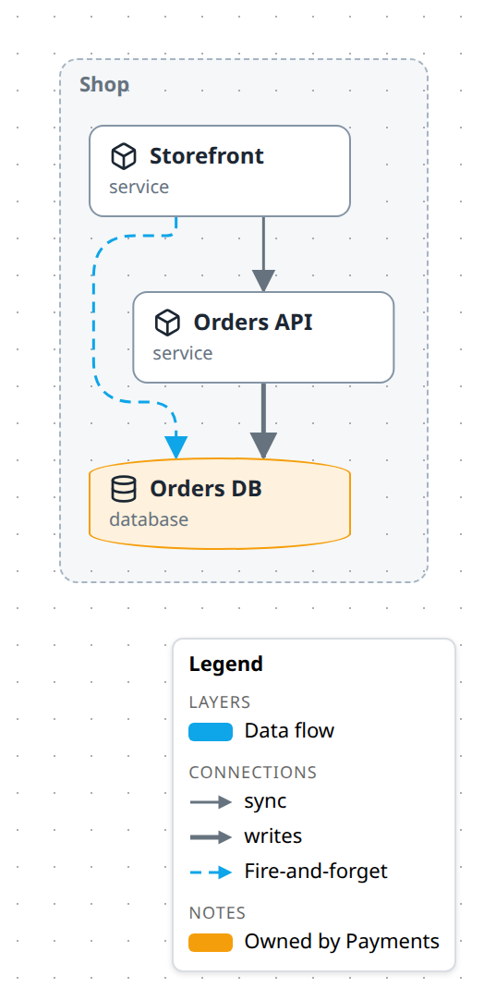](https://ferroman.github.io/diagc/html/docs/legend.html)

An on-canvas key: rows derived from the layers and relation kinds in use, plus two hand-written ones — a caption for a kind, and a colour only the author can explain.
[Live](https://ferroman.github.io/diagc/html/docs/legend.html) · [Source](../../.diagrams/src/docs/legend.diagram.ts) · [Guide](../how-to/add-a-legend.md)

## The docs' own figures

The explanation pages are illustrated with the tool too:
[anatomy of a model](https://ferroman.github.io/diagc/html/docs/model.html) ([source](../../.diagrams/src/docs/model.diagram.ts), in [What is in a model](../explanation/the-model.md)) ·
[the pipeline](https://ferroman.github.io/diagc/html/docs/pipeline.html) ([source](../../.diagrams/src/docs/pipeline.diagram.ts), in [How a diagram becomes a picture](../explanation/architecture.md)) ·
[compiling a view](https://ferroman.github.io/diagc/html/docs/view-compile.html) ([source](../../.diagrams/src/docs/view-compile.diagram.ts), in [What you see is not what is stored](../explanation/views.md)) ·
[the workspace](https://ferroman.github.io/diagc/html/docs/workspace.html) ([source](../../.diagrams/src/docs/workspace.diagram.ts), in the same page).
