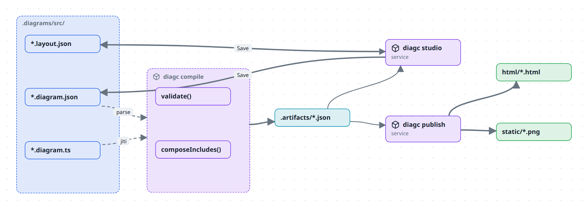
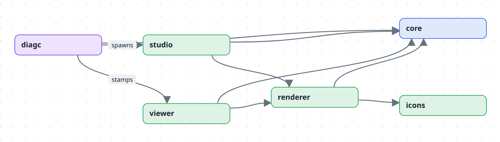

# How a diagram becomes a picture

This explains the shape of the system and why it is split the way it is. It teaches nothing you can type — for that, start with [Tutorial 1](../tutorials/01-your-first-diagram.md).

## The pipeline

Read it left to right. You own everything in `.diagrams/src/`. Everything to the right of `diagc compile` is generated and disposable.

There are **two ways in and one way through**. You either write a `.diagram.ts` file, or you draw in the studio and it writes a `.diagram.json` for you. Both land on the same validated model, so nothing downstream needs to know which route a diagram took.

### Why an artifact at all

The compile step could be skipped — the studio could read your sources directly. It does not, for three reasons:

- **Validation happens once, early.** A relation pointing at a missing node fails at compile time with a file name and a message, not at render time with a blank canvas. The renderer can then assume the model is sound.
- **TypeScript has to be executed to be read.** A `.diagram.ts` is a program; the artifact is its output. Something has to run it, and running it in a browser is not an option.
- **`include` composition needs a resolution step.** A node with an `include` pulls another diagram's content in at compile time. The artifact is the composed result; the source is not.

The artifact directory is gitignored. It is a build output, and regenerating it is one command.

### Why layout is a second file

Positions live in `<name>.layout.json`, never inside the model. Drag a box and only the overlay changes. That keeps "what this diagram means" and "where I happened to put things" in separate diffs — you can review a genuine architectural change without wading through coordinate churn.

The overlay is also *partial*: nodes with no recorded position fall back to automatic layout. You pin only what you care about.

## The packages

| Package | Owns |
| --- | --- |
| `core` | The model — types, `validate()`, the builder DSL, the editor command algebra, and the view compiler. No React, no filesystem. |
| `renderer` | `DiagramView`: React Flow + elk layout, plus the type / kind / theme registries that turn free-form strings into shapes and colours. |
| `icons` | Icon id → lucide component. Nothing else. |
| `diagc` | The CLI: `compile`, `watch`, `publish`, `studio`. The only package that touches the filesystem. |
| `studio` | The browser app — picker, canvas, edit mode, library — plus the dev-server API that reads and writes your `.diagrams/src`. |
| `viewer` | A single-file shell that `publish` stamps a model into. |

The arrows all point toward `core`, and `core` depends on nothing. That is the one structural rule worth preserving: the model has no idea it is going to be drawn.

`diagc` is unusual — it *reads* `viewer`'s built output rather than importing it, and it *spawns* `studio`'s dev server rather than linking against it. Both are process boundaries, not code dependencies, which is what lets `diagc` run against any repo on your machine while the code stays in this one.

## Two ways to look at a diagram

**The studio** is a dev-time tool. It needs a running Vite server because it reads and writes files through a small API, so it only exists where the source is.

**A published page** is a single self-contained HTML file with the model, the layout and every referenced image inlined as data URIs. No server, no network, no build. Mail one to someone and it works.

The two share the same renderer, so a published page folds and unfolds exactly like the studio does. It just cannot save.

## Where things go wrong

- **The studio shows "No artifacts found".** You have not compiled. The studio reads artifacts, not sources.
- **`diagc publish` writes HTML but no PNGs.** The PNG step drives a headless Chrome. Install one or set `CHROME_PATH`. See [Publish and share](../how-to/publish-and-share.md).
- **A diagram opens read-only.** It came from a `.diagram.ts`. Edit the TypeScript. Only JSON-backed diagrams are browser-editable.

## Read next

- [What is in a model](the-model.md) — the data structure and the decisions frozen into it.
- [What you see is not what is stored](views.md) — semantic zoom, planes, layers.
