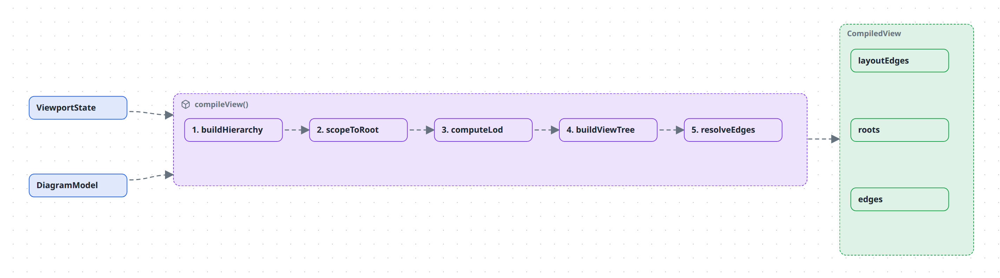

# What you see is not what is stored

A model is five flat arrays. A picture is a tree of boxes at a particular level of detail. This explains the transform between them, and the three independent mechanisms that control it.

For how to use them, see [Use planes and layers](../how-to/use-planes-and-layers.md) and [Organise a large diagram](../how-to/organise-large-diagrams.md).

---

## The transform

`compileView(model, viewport)` runs on every frame that changes what is visible. The model is the same every time; the **viewport** — active plane, active layers, drill root, pins — is what varies.

The five steps, and what each is for:

1. **buildHierarchy** — resolve the active plane's containment edges into a parent/child structure. A different plane produces a different tree from the same nodes.
2. **scopeToRoot** — only when you have drilled into a node. Everything outside becomes an external stub so arrows leaving your subtree still have somewhere to land.
3. **computeLod** — decide which containers are expanded and which are folded. Your pins win over the automatic decision.
4. **buildViewTree** — build the tree to draw, promoting shared nodes up to where all their owners can see them.
5. **resolveEdges** — re-anchor relations whose endpoint got folded away, and aggregate several relations between the same visible pair into one arrow.

The output carries **two** edge sets. `edges` is what gets drawn. `layoutEdges` is the full set, including relations hidden behind an inactive layer, and it is what elk lays out against. That is why toggling a layer changes the arrows but never moves a box — the geometry was computed from everything all along.

Edges are **drawn along the routes that layout computed**, not straight between their two boxes. The arrangement and the routing come from the same run, so a line goes around the box elk placed in its way. A label rides **on** its line: elk makes the label a stop on the route and runs the line through its centre, and the label layer is painted above every edge — a label covers the stretch of line under it, and no line is ever drawn across a label. A route only holds while both of its ends stand where the layout put them: move a box — by hand, from a saved position, or mid-drag — and its edges fall back to floating curves, which follow the box wherever it goes. Notations whose line *is* the notation (a causal loop's arc) always float.

A notation can *steer* the automatic layout instead of replacing it. Second-order thinking derives an order per node (the longest path from a decision) and hands it to elk as layer partitions, so the bands you see are elk's own rows — routing, labels and saved positions all keep working exactly as they do for any layered diagram. That is a different seam from git-graph, whose `layout` computes lanes and columns itself and replaces elk entirely.

The same full set decides what is *independent*. Boxes that no relation ties to the rest of their level — at the top, or inside a container — are arranged on their own and packed into a compact block instead of trailing down the first column; a relation hidden behind a layer still counts as a tie, so a layer toggle cannot regroup them either.

## Three independent controls

They are frequently confused because all three change what you see. They are orthogonal, and it is worth being precise:

| | Changes | Declared on | Default |
| --- | --- | --- | --- |
| **Semantic zoom** | how much detail is unfolded | nothing — it is a gesture | everything folded |
| **Planes** | which containment hierarchy is in force | `planes[]` + `plane` on containment edges | first plane declared |
| **Layers** | which relations and nodes are visible | `layers[]` + `layer` on relations/nodes | all layers off |

### Semantic zoom

The diagram rests fully folded: every group is one box. Double-click a group and it unfolds while the viewport glides into it; double-click again to fold it back.

The rule that makes this readable is that **siblings stay folded**. You are always reading one focused path of detail against a group-level overview, never a fully-exploded graph. The `▸`/`▾` chip on a group's header overrides the automatic decision for that container: it pins the group open or shut.

When a container folds, relations that crossed its boundary do not vanish — they re-anchor to the box that absorbed the hidden endpoint. Several relations between the same visible pair then fold into **one** arrow. If those relations no longer share a single `kind`, the aggregate shows as `mixed`.

What that one arrow is labelled follows a width budget, because at platform altitude there are hundreds of them:

| The aggregate's constituents | Its label |
| --- | --- |
| One distinct label (or the same one repeated) | that label, however long — the renderer ellipsises it at ~24 characters |
| Several, joined in ≤ 32 characters | the join, e.g. `reads / writes` |
| Several, longer than that | `N relations`, N being how many it rolled up |
| None labelled at all | `N relations` |

Naming two short relations is more useful than counting them; naming five long ones is not — it is what turns a folded landscape into a wall of text. Nothing is lost either way: unfold the box, or hover the arrow (its title carries the full text), to see the constituents.

### Planes

A plane is an alternative containment context over the same entities — a transparent sheet laid over the same set of boxes. The `architecture` plane nests services under logical systems; the `infra` plane nests the same services under the cluster they run on. Nothing is duplicated; only the containment edges differ.

Two consequences that surprise people:

- **A node with no containment in the active plane does not exist in that view** — and its relations drop out with it. This is a feature (scope a view by simply not nesting things in it) that reads as a bug the first time you hit it.
- **Switching planes keeps your place.** The groups containing whatever you were looking at open automatically in the new plane.

`containmentOf` lets a plane borrow another's structure instead of declaring its own, which is how you get "the data-flow view *of* the architecture" in one line.

### Layers

A layer is a cross-cutting overlay — data flow, hosting, failure paths. Relations and nodes can be tagged with one.

Layers are **off by default**. Untagged relations always show; a tagged one appears only once you switch its layer on. This keeps secondary concerns out of the way until asked for, and is the mechanism that lets one diagram serve several conversations.

## Gotchas

- **PNG export activates no layers of its own — but a plane's `layers` still draw.** `viewport.activeLayers` left **undefined** means "the host has no opinion", and `compileView` then falls back to the active plane's `layers`. An overlay you want in a committed image therefore belongs either on the base sheet or on a plane that presets it. That is how the data-flow image in [Use planes and layers](../how-to/use-planes-and-layers.md) exists.
- **A plane's `layers` are a default, not a union.** A host that owns a layer switch passes its own `activeLayers`, and a present array — *even an empty one* — replaces the presets rather than adding to them, so a preset layer can be switched off. Such a host must seed its state with `presetLayers(model.planes, plane)` when the view opens and on every plane change; otherwise the diagram opens with its own overlays off. (Unioning them, which is what this did until the switch existed, made a preset layer permanently unturn-off-able.)
- **PNG export unfolds everything.** The image is a flat overview, not the folded resting state. A diagram that reads well folded can be dense as a PNG.
- **Pins are viewer state, not model state.** They are not saved to the diagram file.
- **Automatic follow-the-viewport zoom exists but is off.** `computeFocusChain` is implemented and parked; navigation is by double-click.

## Read next

- [Use planes and layers](../how-to/use-planes-and-layers.md) — a worked example of all three, with images.
- [Organise a large diagram](../how-to/organise-large-diagrams.md) — semantic zoom and pins in practice.
- [What is in a model](the-model.md) — why containment is a DAG, which is what makes promotion necessary.
