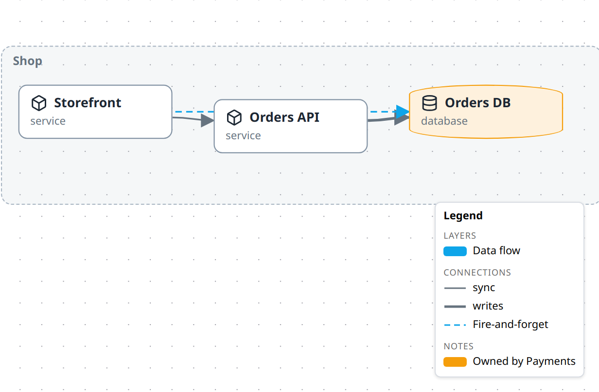

# Add a legend

Give the reader a key to your diagram's colours and line styles — on the canvas, and in the image you commit.



## Switch it on

```ts
m.legend();
```

That is the whole opt-in. A diagram that never calls it has **no legend anywhere** — not in the studio, not in exports. There is no global default to switch off.

A bare call derives every row from the diagram itself. The picture above is that, plus two hand-written lines.

## What gets derived

| `show` key | Heading | Derived from | Default |
| --- | --- | --- | --- |
| `layers` | **Layers** | Declared layers that something in this plane uses — on or off. | on |
| `kinds` | **Connections** | The relation kinds currently drawn. | on |
| `types` | **Elements** | The node types currently drawn. | **off** |

Ask for the third one explicitly:

```ts
m.legend({ show: ['layers', 'kinds', 'types'] });
```

**Connections and elements follow what is drawn.** Fold a group, switch a plane, switch a layer off — kinds and types that no longer appear leave the key. Their order comes from the built-in registry, then alphabetically for ids it does not know, so the list never reshuffles as you fold and unfold.

**Layers are the exception, on purpose.** A layer row is the switch that reveals its overlay, so it cannot vanish while the overlay is hidden — there would be nothing left to click. The Layers section is read from the model instead: every declared layer that something the current plane could draw carries, listed in **declaration order**, on or off. Folding does not change it, and switching a layer off greys its row rather than removing it. Switching *planes* does change it: a layer nothing in the new plane uses drops out.

A connection swatch is drawn from the kind's registry style, and takes the layer tint when every arrow of that kind shares one. That is why `Fire-and-forget` is blue above: every `flow` arrow is on the `data-flow` layer. Where arrows of one kind sit on different layers, or some are on the untinted base sheet, the swatch stays neutral rather than claiming a colour half of them do not have.

## Add what cannot be inferred

A derived row is accurate but terse: a connection row is labelled with the raw kind id. Use `items` for meaning the model does not carry.

```ts
m.legend({
  items: [
    { label: 'Fire-and-forget', kind: 'flow' },
    { label: 'Owned by Payments', color: '#f59e0b' },
  ],
});
```

Those two lines do different things:

- **`kind: 'flow'` already has a derived row, so that row is recaptioned in place.** It keeps its position and its real swatch — `Fire-and-forget`, drawn with the actual `flow` arrow. This is the rename trick: caption a kind without maintaining a list of every other one. `type` works the same way.
- **`color` on its own has nothing to attach to, so it is appended** under *Notes* as a colour chip. That is how you explain a convention the renderer knows nothing about.

| Field | Effect |
| --- | --- |
| `label` | Required. The row's text. |
| `kind` | Swatch is that relation kind's line. Recaptions the derived row when there is one. |
| `type` | Swatch is that node type's shape. Recaptions the derived row when there is one. |
| `color` | Tints whichever swatch is drawn. On its own, a plain chip. |
| `icon` | Icon for a `type` swatch, overriding the registry's. |

## Title and corner

```ts
m.legend({ title: 'Key', position: 'top-left' });
```

`position` is one of `top-left`, `top-right`, `bottom-left`, `bottom-right`. It defaults to **`bottom-right`**, the one corner the studio's own chrome leaves free. `title` defaults to `Legend`.

## In the studio

- **`▤` in the corner controls** shows and hides the panel. It appears only when there are rows to show, and the choice is yours alone — it is never written to the diagram.
- **The caret in the panel header** collapses it down to its title.
- **Click a layer row to toggle that overlay**, exactly like the layer chips. Layers that are off are listed greyed, so the legend doubles as the switch.
- **In edit mode**, the **Legend** checkbox in the **Layers & planes** drawer adds or removes the declaration. It writes a bare `legend: {}`; `title`, `position`, `show` and `items` are authored in the file.

## In exports and on published pages

A declared legend is baked into the PNG and into the published HTML page, with two differences from the studio canvas:

- **Layers that are off are dropped, not greyed.** Neither an image nor a published page offers a layer switch, so a greyed row would be noise — worse, on the page it would look clickable and do nothing. An overlay reaches the key there only if the exported plane presets it in `layers`. The rows that do appear are plain rows, not buttons.
- **The capture frame grows** by the legend's height, so the panel can never cover the diagram.

## Gotchas

- **Connection and element rows describe the drawn view, not the model.** A kind used only by relations behind a switched-off layer has no row at all. Switch the layer on and the row appears. Layer rows are the deliberate exception — see [What gets derived](#what-gets-derived).
- **Neither an export nor a published page shows a greyed row.** If a committed image or page is missing the overlay you wanted explained, preset it on the plane you export — [Use planes and layers](use-planes-and-layers.md) does this for its data-flow figure.
- **`show` replaces the default list, it does not extend it.** `show: ['types']` loses the layer and connection rows.
- **An included diagram's legend is dropped.** `include` grafts nodes, containment, relations and layers; only the root diagram's legend is ever drawn. Declare one on the umbrella.
- **A connection row describes the kind, not one arrow.** Restyle a single relation — `m.relate(a, b, { kind: 'sync', style: { color: '#dc2626' } })` — and that one arrow turns red while the `sync` row stays neutral. A per-relation override is a property of that arrow, not of the kind, so it is deliberately not lifted into the key. Give it an `items` row if it needs explaining.
- **The panel sizes to its longest row, up to 240px.** Past that, labels ellipsize — keep `label` to a few words.

## See also

- [Use planes and layers](use-planes-and-layers.md) — the legend is the reader-facing half of layers
- [Publish and share](publish-and-share.md) — what reaches a committed PNG
- [Model reference](../reference/model.md#diagramlegend) — every field and its default
