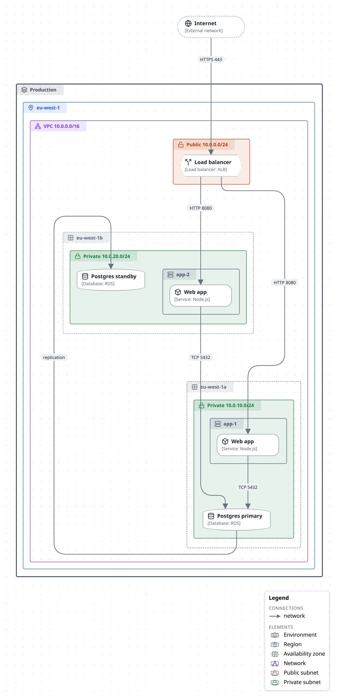

# Draw a deployment diagram

Where the software runs: the environments, regions, availability zones, networks and subnets around it, and the hosts, services, databases and load balancers inside those. What a box sits inside is the information — a private subnet says how it is reached, an availability zone what it fails with — so zones are containers, and the `deployment` notation gives each kind its own colour and a header tab.



## In the studio

1. Create a new JSON diagram and, in **Layers & planes**, set its **Notation** to *Deployment*.
2. In the **Library** tab's *Deployment* section, drag out the zones — **Environment**, **Region**, **Availability zone**, **Network**, **Public subnet**, **Private subnet**, **Cluster**, **Host** — and the nodes that go in them: **Service**, **Database**, **Queue**, **Storage**, **Load balancer**, **Gateway**, **Firewall**, **External network**. A dropped zone is an empty box.
3. Put a node inside a zone from the node's own panel: **Memberships** → *Choose parent…* → the zone → **Add**. Zones nest the same way. Dragging a box into a zone only moves it; the picker is what changes containment.
4. Drag from a connect dot to another node to draw a connection, and give it a label: the port or protocol is usually what a reader wants from the line.

## From TypeScript

There is no special builder: every element is an `m.node` with a `deploy-*` type, and `contains` builds the zones.

```ts
import { model } from '@diagc/core';

const m = model('deployment-starter', { name: 'Two-subnet VPC' });
m.notation('deployment');

const internet = m.node('internet', { name: 'Internet', type: 'deploy-internet' });
const lb = m.node('lb', { name: 'Load balancer', type: 'deploy-load-balancer' });
const app = m.node('app', { name: 'API', type: 'deploy-service', technology: 'Go' });
const db = m.node('db', { name: 'Orders DB', type: 'deploy-database', technology: 'Postgres' });

const pub = m.node('public', { name: 'Public', type: 'deploy-subnet-public' }).contains(lb);
const priv = m.node('private', { name: 'Private', type: 'deploy-subnet-private' }).contains(app, db);
m.node('vpc', { name: 'VPC', type: 'deploy-network' }).contains(pub, priv);

m.relate(internet, lb, { kind: 'network', label: 'HTTPS 443' });
m.relate(lb, app, { kind: 'network', label: 'HTTP 8080' });
m.relate(app, db, { kind: 'network', label: 'TCP 5432' });

export default m;
```

The full example at the top of this page is `.diagrams/src/examples/deployment/web-app.diagram.ts`: two availability zones, a host per zone with the service inside it, and a replicated database.

## The vocabulary

| Type | Look on this notation |
| --- | --- |
| `deploy-environment` | solid, heavier outline and tab in slate |
| `deploy-region` | solid outline and tab in blue |
| `deploy-zone` | dashed outline and tab in grey — an availability zone or any other failure domain |
| `deploy-network` | solid outline and tab in violet — a VPC, a VNet, a LAN |
| `deploy-subnet-public` | amber wash, outline and tab |
| `deploy-subnet-private` | green wash, outline and tab |
| `deploy-cluster` | dashed outline and tab in teal |
| `deploy-host` | solid outline and tab in grey; a leaf when its workloads are not drawn |
| `deploy-service`, `deploy-database`, `deploy-queue`, `deploy-storage` | rounded box, cylinder, pill, cylinder |
| `deploy-load-balancer`, `deploy-gateway` | hexagon |
| `deploy-firewall` | box |
| `deploy-internet` | dashed pill — the internet, or any network you do not own |

Each type prints its own subtitle (`[Database]`), and `technology` joins it: `[Database: Postgres]`. A zone's header shows only its icon and name, so the legend names the zones for you.

The colours are theme tokens: they lift in the dark theme. A node's own `color` still wins over its zone colour.

C4's **Deployment Node** (`c4-deployment-node`) draws as a host on this notation, so a C4 deployment diagram can switch to it and keep its types.

## Related

- [Draw a C4 diagram](draw-a-c4-diagram.md) — the software the deployment runs.
- [Use the icon library](use-the-icon-library.md) — the AWS group stencils, for a diagram that should look like AWS's own.
- [Add a legend](add-a-legend.md)
