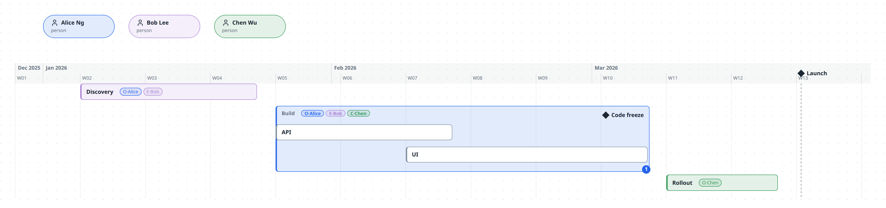
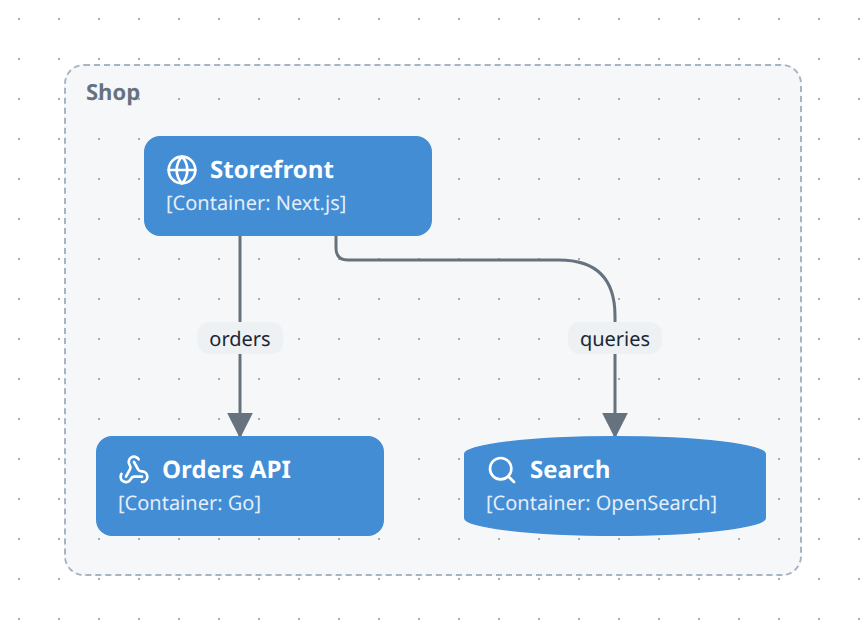

# Draw a plan

A schedule: zones as date bars that nest, events as milestones, people attached to a zone as owner, executor or checker. A calendar runs left to right — the layout, not you, places every box on that axis — and containment is what is scheduled inside what, so a phase with two work streams is a zone with two nested zones.

## In the studio

1. Create a new diagram (or add a plane to an existing one) and, in **Layers & planes**, set its **Notation** to *Plan (schedule)*.
2. Press **Edit**. The **Plan** panel appears on the right.
3. Drop a **Zone** from the Library's *Plan* category — it lands two weeks wide at the date under the pointer (a zone dropped inside another starts where its parent does) — and name it; drop a second zone **onto** the first to nest it. A node turned into a Zone or Event afterwards (Properties → Type, or a Plan card applied to the selection) is dated the same way: today, or its parent's start when it is already nested.
4. Drag a bar sideways to move its dates by whole days (a nested bar stays inside its parent); drag it up or down to reorder top-level bars. Drag its left or right edge to change the start or the end.
5. Drop an **Event** for a milestone.
6. Add people with **Add person** in the Plan panel, then pick them as Owner / Executor / Checker on a zone — the chips `O·`, `E·`, `C·` appear on the bar, one letter per role, hover for the full name.
7. Schedule a node that lives on another plane (a C4 container, an ER table…) by selecting it and, in Properties → Memberships, adding the zone as a container on the plan plane.
8. Comment on a bar in Properties → Comments and attach resources in Properties → Links — the badge at the bar's corner opens both on the published page.

## From TypeScript

```ts
import { model } from '@diagc/core';

// Copy this file, rename the zones and the people, and move the dates.
const m = model('launch-plan', { name: 'Launch plan' });
const plan = m.plan();

const alice = plan.person('alice', 'Alice Ng', { color: '#2f6fed' });
const bob = plan.person('bob', 'Bob Lee', { color: '#b08ad9' });
const chen = plan.person('chen', 'Chen Wu', { color: '#3a9d5d' });

const discovery = plan.zone('discovery', { name: 'Discovery', start: '2026-01-05', end: '2026-01-23', color: '#b08ad9' });
discovery.owner(alice).executor(bob);

const build = plan.zone('build', { name: 'Build', start: '2026-01-26', end: '2026-03-06', color: '#2f6fed' });
build.owner(alice).executor(bob).checker(chen);
build.zone('api', { name: 'API', start: '2026-01-26', end: '2026-02-13' });
build.zone('ui', { name: 'UI', start: '2026-02-09', end: '2026-03-06' });
build.event('code-freeze', { name: 'Code freeze', at: '2026-03-02' });
build.comment('UI started a week late; the freeze holds', { by: 'Alice Ng', at: '2026-02-16' });
build.link('Tracker', 'https://example.com/board/launch');

plan.zone('rollout', { name: 'Rollout', start: '2026-03-09', end: '2026-03-20', color: '#3a9d5d' }).owner(chen);
plan.event('launch', { name: 'Launch', at: '2026-03-23' });

export default m;
```

`m.plan()` declares the plan plane and hands back a `PlanBuilder`. `plan.zone(id, opts)` is a top-level zone; call `.zone(...)` on a zone to nest another one inside it, and `.event(...)` for a milestone in it — `ZoneBuilder.event()` returns a plain `NodeRef`, so keep it last in a chain, as `build.event('code-freeze', …)` is above. `plan.person(id, name?, opts?)` declares a person; `.owner()`, `.executor()` and `.checker()` on a zone each add a role relation from that person to the zone. A `ZoneBuilder` is a `NodeRef`, so `.comment()` and `.link()` chain on it too. To schedule a node from another plane — a C4 container, an ER table — call `.contains()` on the zone with that node's ref; the node stays shared, only the plan plane gains a new containment edge. See [Builder API reference](../reference/builder-api.md#mplanid-opts--planbuilder).

## What to know

- **Dates are `YYYY-MM-DD`, and `end` is inclusive.** A zone spanning `2026-01-05` to `2026-01-23` covers the 23rd, not up to it.
- **`x` is always the date — the layout owns it.** `y` is free only for a top-level zone (drag it up or down to reorder); rows inside a zone are automatic, sorted by start date, never hand-arranged.
- **People are relations, not containment.** `owns` / `executes` / `checks` runs from the person to the zone, so one person can hold a role on many zones, and a zone can be shared by several people in the same role.
- **Role relations never draw as arrows.** `owns`, `executes` and `checks` become the `O·` / `E·` / `C·` chips on the zone instead. Any other relation kind between two zones (`sync`, …) draws as an ordinary dependency arrow.
- **The today line follows the reader's clock, and it is never in the PNG.** An export has no "tomorrow" to be wrong about, so publishing draws the header with no today line at all — open the page instead to see it.
- **Five validation codes are specific to a plan:** `plan-date` (a date isn't real `YYYY-MM-DD`), `plan-missing` (a zone lacks `start`/`end`, or an event lacks `at`), `plan-span` (a zone's `end` is before its `start`), `plan-nested` (a nested zone or event falls outside its parent's span), `plan-role-target` (a role relation points at something other than a `plan-zone`).
- Assigning a role by dragging a person onto a zone, and hand-ordering the rows a zone's children fall into, are both follow-ups — not yet built; roles go through the Plan panel's pickers, and rows sort by start date only.

## Examples

**Starter** — three phases, one nested twice, a code freeze and a launch, three people holding all three roles on Build, a comment and a link. Copy it into `.diagrams/src/` and change the names. [Source](../../.diagrams/src/examples/plan/starter.diagram.ts)

[](https://ferroman.github.io/diagc/html/examples/plan/starter.html)

**Q4 roadmap** — a C4 container view and a plan plane that schedules those same containers inside zones — switch planes on the page to see either. [Source](../../.diagrams/src/examples/plan/q4-roadmap.diagram.ts)

[](https://ferroman.github.io/diagc/html/examples/plan/q4-roadmap.html)

## See also

- [Model reference](../reference/model.md#plan-conventions) — the node types, roles, metadata keys and validation codes
- [Builder API](../reference/builder-api.md#mplanid-opts--planbuilder) — `plan`, `zone`, `event`, `person`, `owner`/`executor`/`checker`
- [Comment on a diagram](comment-on-a-diagram.md) — the same comments and links a zone or event carries
- [Use planes and layers](use-planes-and-layers.md) — adding a plan plane beside an existing view, and switching between them
