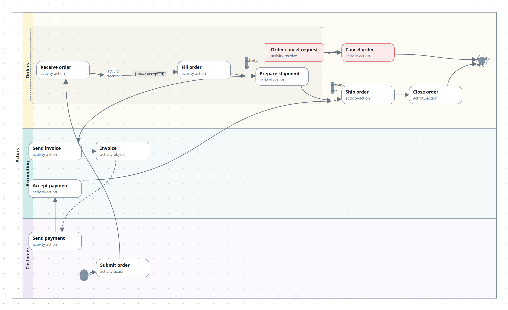

# Draw an activity diagram

Show a workflow as a UML activity diagram: swimlanes of actions, forks and joins, decisions, and signals passing between actors — an **activity frame** containing **lanes**, each lane containing the elements that actor performs.



A frame's children must be lanes; a lane's children are the flow (actions, objects, signals, decisions, fork/join bars, start/end, notes) plus, optionally, one or more interruptible **regions**, each hosting that same set of flow elements (a region does not nest further regions). A canvas can hold several frames — `m.activity()` is repeatable, and frames are ordinary containers on whatever plane the model uses, no notation required.

## In TypeScript

1. Declare the frame, then its lanes top to bottom:

   ```ts
   import { model } from '@diagramming/core';

   const m = model('docs-activity', { name: 'Order processing' });
   const act = m.activity('actors', { name: 'Actors' });
   const orders = act.lane('orders', { name: 'Orders', color: '#f6d55c' });
   const accounting = act.lane('accounting', { name: 'Accounting', color: '#3caea3' });
   const customer = act.lane('customer', { name: 'Customer', color: '#b39ddb' });
   ```

2. Fill each lane with elements. `action`, `object`, `send` and `receive` all take an id and a name; `decision`, `bar`, `start` and `end` are unlabelled and auto-id if you don't name one; `region()` (lanes only) nests an interruptible sub-area that hosts the same element helpers:

   ```ts
   const start = customer.start();
   const submit = customer.action('submit-order', 'Submit order');
   const region = orders.region('cancelable');
   const cancelReq = region.receive('cancel-request', 'Order cancel request', { color: '#e57373' });
   const receive = region.action('receive-order', 'Receive order');
   const accepted = region.decision('accepted');
   const fill = region.action('fill-order', 'Fill order');
   const fork = region.bar('fork');
   const prepare = region.action('prepare-shipment', 'Prepare shipment');
   const join = orders.bar('join');
   const ship = orders.action('ship-order', 'Ship order');
   const close = orders.action('close-order', 'Close order');
   const cancel = orders.action('cancel-order', 'Cancel order', { color: '#e57373' });
   const end = orders.end();
   const invoice = accounting.object('invoice', 'Invoice');
   const sendInvoice = accounting.action('send-invoice', 'Send invoice');
   const accept = accounting.action('accept-payment', 'Accept payment');
   const pay = customer.action('send-payment', 'Send payment');
   ```

   Auto-ids follow `${scopeId}-<suffix>`, then `-2`, `-3`, … per scope and suffix — `orders.bar()` twice in the same lane gives `orders-bar` and `orders-bar-2`.

3. Wire the flow. `flow` draws a solid control arrow, `objectFlow` a dashed one for data passing between actions, `interrupt` a zigzag from an interrupting signal, and `noteLink` a headless dashed line from a note to what it annotates. A guard is just a relation label:

   ```ts
   act
     .flow(start, submit)
     .flow(submit, receive)
     .flow(receive, accepted)
     .flow(accepted, fill, '[order accepted]')
     .flow(fill, fork)
     .flow(fork, prepare)
     .flow(fork, sendInvoice)
     .flow(prepare, join)
     .flow(join, ship)
     .flow(ship, close)
     .flow(close, end)
     .objectFlow(sendInvoice, invoice)
     .objectFlow(invoice, pay)
     .flow(pay, accept)
     .flow(accept, join)
     .interrupt(cancelReq, cancel)
     .flow(cancel, end);

   export default m.toJSON();
   ```

4. `pnpm compile`, then open it in the studio or publish it.

The whole picture above is `.diagrams/src/docs-activity.diagram.ts` in this repo.

## In the studio

1. Drag an **Activity frame** off the palette (**UML · Activity** category) onto the canvas.
2. Select the frame — the **Activity** panel appears on the right with a *Lanes* section. Name a lane, pick a colour if you like, and **Add lane**. Repeat three times; lanes stack top to bottom in the order you add them.
3. Select a lane (or a region inside one) — the panel switches to *Elements*: an optional name field plus one quick-add button per leaf type (action, decision, fork/join bar, start, end, send signal, receive signal, object, note), and, on a lane, **Add region** for an interruptible sub-area. Each quick-add parents the new node correctly and drops it at a deterministic spot inside the selected scope — no drag-and-drop needed to get it into the right container.
4. Connect elements by dragging from one to another, the same gesture as any diagram. New connections start as a plain `sync` relation; select the arrow and set its **Kind** to `control`, `object-flow`, `interrupt` or `note-link` to match what it means. Give it a **Label** like `[order accepted]` for a guard.
5. Rename, recolour and delete lanes, regions and elements the same way as any node.

## What to know

- **Bars, start and end ignore `color`.** They draw in a neutral stroke token regardless of what the node sets — there's no per-node colour on fixed UML glyphs in v1.
- **Lane order is declaration order**, same as git-graph lanes — there's no drag-to-reorder yet.
- **Loose elements are legal.** A leaf dropped or created with no lane, or a region with no parent at all, doesn't fail validation — it just doesn't draw as part of the frame. Home it with the node panel's containment editor (its *Memberships* section), the same path any other stray node uses. A region contained by something other than a lane, though, **is** a validation error (`activity-region-parent`) — "unparented" and "wrongly parented" are different things.
- **Rules the compiler and the studio's save both enforce**, each with a [validation code](../reference/model.md#validation-codes): an activity frame's children must all be lanes; a lane must be contained by a frame; a region must be contained by a lane if it's contained by anything at all.
- **No semantic checking.** Decision fan-out, token conservation, whether a fork's branches ever join — none of that is verified. This is an illustrative tool, not a UML checker.

## See also

- [Builder API](../reference/builder-api.md#mactivityid-opts--activitybuilder) — `activity`, `lane`, `region`, the element helpers, `flow`/`objectFlow`/`interrupt`/`noteLink`
- [Model reference](../reference/model.md#activity-diagram-conventions) — node types, relation kinds and validation codes
- [Publish and share](publish-and-share.md) — the page and the PNG work as for any diagram
