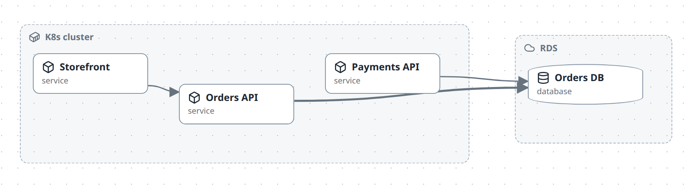
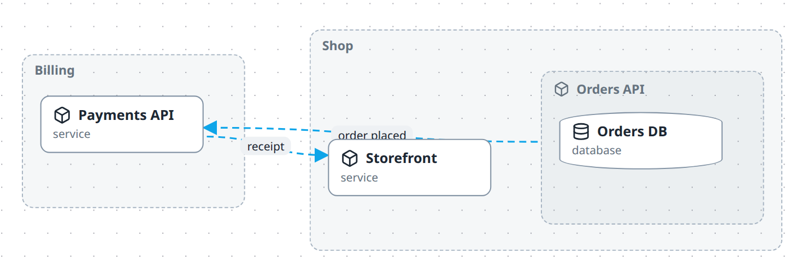

# Use planes and layers

Two mechanisms let one diagram answer several questions. They are easy to confuse, so start here:

| | **Plane** | **Layer** |
| --- | --- | --- |
| Changes | which boxes are **inside** which | which arrows and nodes are **visible** |
| Think of it as | a different **hierarchy** over the same entities | a transparent **overlay** on top |
| Declared on | `planes[]`, plus `plane` on containment edges | `layers[]`, plus `layer` on relations and nodes |
| Switched with | the plane switcher — one at a time | layer toggles — any combination |
| Default | the first plane declared | all layers **off** |

One sentence each:

- **A plane answers "where does this live?"** — the same service is inside its logical system on one plane and inside the cluster it runs on in another.
- **A layer answers "what else is true?"** — the structure stays put and extra arrows appear.

---

## What they are for

| You want | Reach for |
| --- | --- |
| Logical ownership *and* physical deployment of the same services | **plane** |
| A team-ownership view over the same systems | **plane** |
| A view scoped to one product area, with everything else gone | **plane** (leave the rest uncontained, or use `hides`) |
| Data flow drawn over the architecture | **layer** |
| Failure and retry paths, shown only when discussing resilience | **layer** |
| Which calls are synchronous, on demand | **layer** |
| A node that only exists in one context (a build agent, a bastion) | **layer** on the node, or `plane` on the node |
| Detail hidden until someone asks for it | neither — [semantic zoom](organise-large-diagrams.md) already does that |

If you are declaring a plane whose containment is identical to another's, you actually wanted `containmentOf` plus a layer.

---

## A worked example

One model, three views. The full source is `.diagrams/src/docs-planes.shared.ts`.

### The entities, declared once

```ts
const shop = m.node('shop', { type: 'system', name: 'Shop' });
const billing = m.node('billing', { type: 'system', name: 'Billing' });
const web = m.node('web', { type: 'service', name: 'Storefront' });
const orders = m.node('orders', { type: 'service', name: 'Orders API' });
const payments = m.node('payments', { type: 'service', name: 'Payments API' });
const db = m.node('db', { type: 'database', name: 'Orders DB' });

const k8s = m.node('k8s', { type: 'infra', icon: 'kubernetes', name: 'K8s cluster' });
const rds = m.node('rds', { type: 'aws-rds', name: 'RDS' });
```

### Plane 1 — architecture: who owns what

```ts
m.plane('architecture', { name: 'Architecture', hides: ['k8s', 'rds'] });

shop.contains(web, orders, { plane: 'architecture' });
billing.contains(payments, { plane: 'architecture' });
orders.contains(db, { plane: 'architecture' });
```


### Plane 2 — infra: where it runs

```ts
m.plane('infra', { name: 'Infrastructure', hides: ['shop', 'billing'] });

k8s.contains(web, orders, payments, { plane: 'infra' });
rds.contains(db, { plane: 'infra' });
```



Same six entities. Nothing is duplicated — only the containment edges differ. `Storefront` is inside `Shop` on one plane and inside `K8s cluster` on the other.

Note the `hides` on each plane: `K8s cluster` has no containment in the architecture plane, so without `hides` it would drift in as an empty box. See [Keep a plane clean](#keep-a-plane-clean) below.

### Plane 3 — data flow: the architecture, plus an overlay

```ts
m.layer('data-flow', { name: 'Data flow', tint: '#0ea5e9' });

m.relate(orders, payments, { kind: 'flow', label: 'order placed', layer: 'data-flow' });
m.relate(payments, web, { kind: 'flow', label: 'receipt', layer: 'data-flow' });

m.plane('flow', {
  name: 'Data flow',
  containmentOf: 'architecture',   // reuse that hierarchy, do not redeclare it
  layers: ['data-flow'],           // with this overlay already on
  baseRelations: false,            // and the ordinary arrows hidden
});
```



Same boxes as the architecture plane, because it borrowed that structure. The `writes`, `reads` and `sync` arrows are gone; only the two blue layer arrows remain.

Those three options are the whole trick, and they compose:

| Option | Effect |
| --- | --- |
| `containmentOf: 'architecture'` | Do not declare containment — borrow it |
| `layers: ['data-flow']` | This layer is **always on** in this plane |
| `baseRelations: false` | Hide untagged relations, leaving only layer arrows |

---

## Recipes

### Add an overlay to an existing diagram

```ts
m.layer('retries', { name: 'Retries', tint: '#dc2626' });
m.relate(orders, payments, { kind: 'async', label: 'retry 3×', layer: 'retries' });
```

That is all. The layer is off by default, so nothing changes until someone switches it on. Layout is computed from the full relation set, so toggling it moves no boxes.

### Show a node only on one overlay

```ts
m.node('bastion', { type: 'infra', name: 'Bastion host', layer: 'ops' });
```

The node appears only while the `ops` layer is active — same rule as relations.

### Restrict a node to one plane

```ts
m.node('k8s', { type: 'infra', name: 'K8s cluster', plane: 'infra' });
```

The node exists only in that plane. Use this for containers that are meaningless elsewhere — but note it does **not** compose with `containmentOf`: a node pinned to `architecture` will not appear in a plane that merely borrows architecture's structure. For that case use `hides` on the other planes instead, which is what the worked example does.

### Keep a plane clean

A node with no containment in the active plane does not disappear — it becomes a **root**, floating in as an empty box. Two ways to deal with it:

```ts
m.plane('architecture', { name: 'Architecture', hides: ['k8s', 'rds'] });   // per plane
m.node('k8s', { type: 'infra', name: 'K8s cluster', plane: 'infra' });      // per node
```

`hides` is for nodes shared across planes. Listing a node that already has `plane` set is a `redundant-hide` validation issue.

### Preset a reviewer's starting view

```ts
m.plane('security', {
  name: 'Security review',
  containmentOf: 'architecture',
  layers: ['authn', 'secrets'],
  baseRelations: false,
});
```

Anyone who picks that plane lands with exactly the two overlays on and nothing else in the way.

---

## In the studio

Open the **Layers & planes** drawer from the edit-mode toolbar.

- **Add a layer** — id, name, tint. It appears immediately as a toggle.
- **Add a plane** — id, name, whether it borrows another plane's containment, and which layers it presets.
- **Switch planes** with the plane switcher in the header. Your place is kept: the groups containing whatever you were looking at open automatically in the new plane.
- **Toggle layers** from the layer chips. Arrows appear and disappear; boxes never move.

When you drag a node into a new parent, the containment edge is created **on the plane you are currently viewing**. Switch to the plane you mean to edit before rearranging.

---

## Gotchas

- **Untagged containment belongs to the first-declared plane.** `shop.contains(web)` with no `{ plane }` is not "on every plane" — it is on the default one. In a diagram with several planes, tag containment explicitly, or reordering your `m.plane(...)` calls will silently change what the diagram means.
- **`containmentOf` borrows edges tagged for that plane.** If your architecture edges are untagged and `architecture` is not declared first, a plane borrowing `architecture` gets nothing and every node floats loose.
- **A node with no containment in a plane becomes a root**, not a hidden node — an empty box, not an absence. Use `hides` or a node-level `plane`.
- **Relations vanish with their endpoints.** If a node is not in the active plane, arrows touching it are not drawn.
- **Layers are off by default, but a plane's `layers` are always on** — including in exported PNGs. That is how the data-flow image above exists.
- **`baseRelations: false` hides untagged relations only.** Relations on *other* layers still appear if those layers are on.
- **Layer toggles never move boxes.** If yours do, something else changed — layout is computed from the full relation set on purpose.

## See also

- [Add a legend](add-a-legend.md) — the reader-facing half of layers. A tint means nothing to someone who did not author the diagram; a legend names it, and is what carries that meaning into a committed image
- [Organise a large diagram](organise-large-diagrams.md) — semantic zoom and pins, the other half of keeping things readable
- [What you see is not what is stored](../explanation/views.md) — how the view compiler resolves all this
- [Builder API reference](../reference/builder-api.md#mplaneid-opts--m) — every plane and layer option
