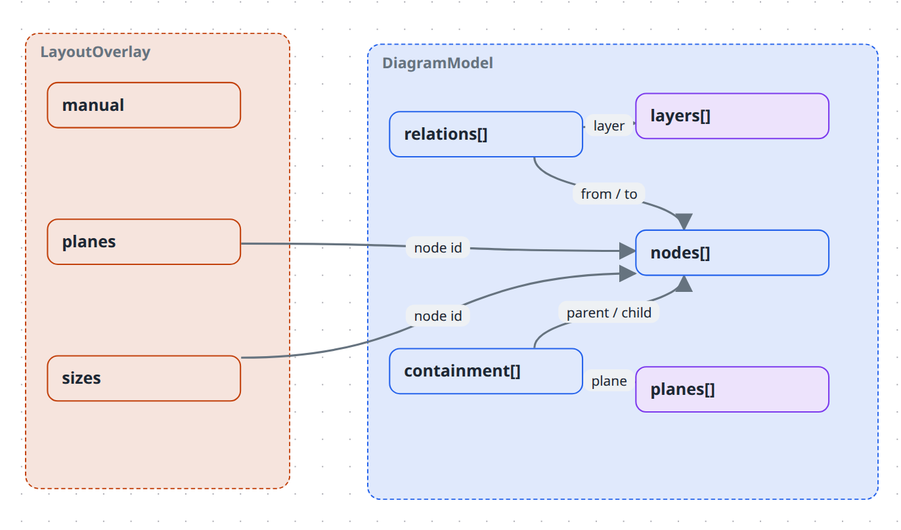

# Model reference

Every field of a compiled diagram, and every way the compiler can reject one. Source of truth: `packages/core/src/types.ts` and `packages/core/src/validate.ts`.

For *why* the model is shaped like this, see [What is in a model](../explanation/the-model.md).



## `DiagramModel`

| Field | Type | Notes |
| --- | --- | --- |
| `version` | `1` | Required. Only value accepted. |
| `id` | `string` | Diagram identity. |
| `name` | `string` | Display name. |
| `style` | `string?` | Renderer style preset pinned by this file. Unknown ids fall back to the app preference. |
| `notation` | `string?` | Visual language for the whole diagram — built in: `causal-loop`, `git-graph`, `c4` (see [C4 stencils](../how-to/draw-a-c4-diagram.md)). A plane's own `notation` wins where one is declared; this is the fallback for planeless (or plane-silent) diagrams. Unknown ids fail validation (`unknown-notation`), same as an unknown plane `notation`. Dropped from included models on graft, same as `typeColors`/`layerRules` — the host's `notation` (if any) is what's drawn. |
| `legend` | `DiagramLegend?` | Opt-in key for the diagram's visual vocabulary. Absent means no legend anywhere. |
| `typeColors` | `Record<string, string>?` | Default accent colour per node type; `*` is the fallback. A node's own `color` wins. Dropped from included models on graft — the host owns the look. |
| `layerRules` | `LayerRule[]?` | Class → layer for relations without a `layer`: `{ kind?, color?, layer }`, every named field must match, first match wins, explicit `layer` beats the rules. Dropped from included models on graft. |
| `nodes` | `DiagramNode[]` | |
| `containment` | `ContainmentEdge[]` | |
| `relations` | `DiagramRelation[]` | |
| `layers` | `DiagramLayer[]` | |
| `planes` | `DiagramPlane[]` | Empty means one implicit plane and no switcher. |

Style preset ids: `clean` (default), `sketch`, `hand-drawn`, `pencil`, `blueprint`, `marker`.

## `DiagramNode`

| Field | Type | Notes |
| --- | --- | --- |
| `id` | `string` | Unique within the model. |
| `name` | `string` | The label drawn on the canvas. |
| `type` | `string?` | Free-form; resolved by the renderer's type registry. Omit for a bare label. |
| `icon` | `string?` | Free-form; resolved by the icon registry. |
| `image` | `string?` | Asset ref — the node renders as the picture itself. |
| `shape` | `string?` | SVG silhouette ref, drawn as a tintable mask filled with `color`. Takes precedence over `image`. |
| `color` | `string?` | Accent colour; overrides the type registry's look. Also wins over a notation's fill (e.g. C4's solid palette) — see [Draw a C4 diagram](../how-to/draw-a-c4-diagram.md#what-to-know). |
| `textColor` | `string?` | Label colour, independent of `color`. |
| `technology` | `string?` | Implementation technology, composed into the type subtitle: `[Container: Java, Spring Boot]`. Meaningful in any notation, not just C4. |
| `description` | `string?` | Shown in the detail panel — **never on the canvas**. |
| `rich` | `TextRun[]?` | Bold/italic label runs. When present, `name` must equal the concatenated text. |
| `textAlign` | `'left' \| 'center' \| 'right'?` | Default `left`. |
| `fontScale` | `'sm' \| 'md' \| 'lg'?` | Default `md`. |
| `metadata` | `Record<string, unknown>?` | Free-form; not validated. |
| `key` | `string?` | Cross-diagram identity. Pattern `^[a-z0-9][a-z0-9-]*$`. |
| `include` | `string?` | URL or path to another `*.diagram.json` composed under this node at compile time. |
| `includePlane` | `string?` | Which of the included diagram's planes supplies the grafted structure (default: its default plane). Meaningful only beside `include`; an id the included diagram doesn't declare fails composition, not validation. |
| `includePlanes` | `boolean?` | Carry every plane the included diagram declares over too — namespaced (`<include-id>/<plane-id>`, name `<Include>/<Plane>`), notation intact — so each is viewable standalone via the plane switcher. Additive to `includePlane`/the default graft, which is unaffected. Meaningful only beside `include`. |
| `plane` | `string?` | Restrict the node to one plane. Omit to share it across all. |
| `layer` | `string?` | The node shows only while this layer is active. |
| `columns` | `Column[]?` | ER-table rows; rendered when `type` is `db-table`. |

### Asset refs (`image`, `shape`)

Two forms are accepted, and nothing else:

- `^[a-z0-9]+\.(png|jpe?g|svg|webp|gif)$` — a content-hashed file in `.diagrams/src/assets/`.
- `^/library/[a-z0-9-]+/[a-z0-9-]+\.(png|jpe?g|svg|webp|gif)$` — a bundled library asset. **Exactly one directory level**, lowercase kebab-case only.

### `Column`

| Field | Type | Notes |
| --- | --- | --- |
| `name` | `string` | Unique within the table. |
| `type` | `string?` | Shown right-aligned, e.g. `uuid`, `text`. |
| `pk` | `boolean?` | Primary-key member. |
| `fk` | `boolean?` | Drives the FK marker and the row-port edge origin. |

## `ContainmentEdge`

| Field | Type | Notes |
| --- | --- | --- |
| `parent` | `string` | Node id. |
| `child` | `string` | Node id. |
| `plane` | `string?` | Absent means the model's default (first-declared) plane — **not** "all planes". |

A node may appear as `child` in several edges — containment is a DAG. Cycles are rejected per plane.

Because an absent `plane` resolves to whichever plane was declared first, plane declaration order is semantically significant in a multi-plane model. A plane using `containmentOf` borrows only the edges tagged for the plane it names.

## `DiagramRelation`

| Field | Type | Notes |
| --- | --- | --- |
| `id` | `string` | Unique. The builder generates `from->to#n`. |
| `from`, `to` | `string` | Node ids. |
| `kind` | `string` | Free-form; resolved by the kind registry. |
| `label` | `string?` | Legacy single label. |
| `labels` | `EdgeLabel[]?` | Positioned labels; supersedes `label` when present. |
| `style` | `RelationStyle?` | Per-relation visual overrides. |
| `description` | `string?` | |
| `layer` | `string?` | Must match a declared layer id. |
| `polarity` | `'+' \| '-'?` | Causal-loop diagrams only. Colours the link green (`+`) or red (`-`) unless `style.color` or a layer tint says otherwise. |
| `delay` | `boolean?` | Causal-loop diagrams only. |
| `fromColumn` | `string?` | FK column on `from`; anchors the edge to that row. |
| `toColumn` | `string?` | Referenced column on `to`; defaults to the target's primary key. |

### `RelationStyle`

| Field | Values | Default |
| --- | --- | --- |
| `shape` | `curved` \| `straight` \| `step` | `curved` |
| `color` | any CSS colour | the layer tint, then the causal-loop polarity colour |
| `width` | number (px) | the kind's width |
| `line` | `solid` \| `dashed` \| `dotted` | the kind's line |
| `end` | `arrow` \| `dot` \| `square` \| `diamond` \| `none` | `arrow` |
| `fromSide`, `toSide` | `top` \| `right` \| `bottom` \| `left` | unset — floats to the facing side |
| `animated` | boolean | the kind's setting |
| `curvature` | number | `0.25` |
| `bow` | `left` \| `right` | `left` |

### `EdgeLabel`

| Field | Type | Notes |
| --- | --- | --- |
| `id` | `string` | |
| `text` | `string` | |
| `t` | `number?` | Position along the edge, 0–1. Default `0.5`. |
| `side` | `'top' \| 'bottom' \| 'center'?` | Default `center`. |

## `DiagramLayer`

| Field | Type | Notes |
| --- | --- | --- |
| `id` | `string` | |
| `name` | `string` | |
| `tint` | `string?` | Colour for this layer's relations. |

## `DiagramPlane`

| Field | Type | Notes |
| --- | --- | --- |
| `id` | `string` | |
| `name` | `string` | |
| `containmentOf` | `string?` | Borrow another plane's containment instead of declaring your own. |
| `layers` | `string[]?` | Layers switched on when this plane is selected. |
| `baseRelations` | `boolean?` | `false` hides untagged relations, leaving only layer arrows. |
| `notation` | `string?` | Visual language, overriding the model's `notation` for this plane. Built in: `causal-loop`, `git-graph` (see [Git graph conventions](#git-graph-conventions)), `c4` (see [Draw a C4 diagram](../how-to/draw-a-c4-diagram.md)). |
| `hides` | `string[]?` | Shared node ids this plane hides; their children are promoted into their place. |
| `hidesTree` | `string[]?` | Shared node ids this plane hides along with everything inside them (a child with another visible parent stays). |

## `DiagramLegend`

Present only if the diagram declares one. See [Add a legend](../how-to/add-a-legend.md).

| Field | Type | Notes |
| --- | --- | --- |
| `title` | `string?` | Panel heading. Default `Legend`. |
| `position` | `string?` | `top-left`, `top-right`, `bottom-left`, `bottom-right`. Default `bottom-right`. |
| `show` | `string[]?` | Derived sections to include: `layers`, `kinds`, `types`. Default `['layers', 'kinds']` — replaced, not extended. |
| `items` | `LegendItem[]?` | Hand-written rows, appended after the derived ones. |

Derived rows come from two different places, and the difference is visible:

- **`kinds` and `types` come from the compiled view** — the arrows and boxes actually drawn. They follow the active plane, the active layers and what is currently unfolded; a kind whose only arrows are behind a switched-off layer has no row. Order within the section is the built-in registry's, then alphabetical for ids it does not know.
- **`layers` comes from the model, per plane** — every declared layer that something the active plane could draw carries, whether it is switched on or off, in **declaration order**. Folding changes nothing here: a layer row is the switch that reveals its overlay, so it has to stay put while the overlay is hidden. When the plane borrows another's containment (`containmentOf`), relevance is resolved against the donor plane, the same way the view is; when you have drilled into a node, it is resolved against that node's interior.

Inactive layer rows are listed **greyed** wherever the host can toggle them (the studio). Where nothing can — a published page, an exported PNG — they are **omitted** instead of shown as a row no click can change.

A `kinds` swatch is the kind's registry style, tinted when every drawn arrow of that kind shares one layer tint. A per-relation `style.color` describes one arrow rather than the kind, so it is never lifted into a row.

### `LegendItem`

| Field | Type | Notes |
| --- | --- | --- |
| `label` | `string` | Required, non-empty. |
| `type` | `string?` | Swatch drawn as this node type's shape. |
| `kind` | `string?` | Swatch drawn as this relation kind's line. |
| `color` | `string?` | Tints whichever swatch is drawn; on its own, a plain chip. |
| `icon` | `string?` | Icon for a `type` swatch, overriding the registry's. |

An item naming a `kind` or `type` that already has a derived row **recaptions that row in place**, keeping its position and swatch, instead of appending a new one.

## `LayoutOverlay` (`<name>.layout.json`)

| Field | Type | Notes |
| --- | --- | --- |
| `version` | `1` | |
| `planes` | `Record<plane, Record<nodeId, {x, y}>>` | Positions, per plane. |
| `sizes` | `Record<nodeId, {w, h}>?` | Plane-independent — a node is the same size everywhere. |
| `manual` | `Record<plane, true>?` | Planes with automatic layout switched off. |
| `settings` | `Record<plane, LayoutSettings>?` | Per-plane automatic-layout settings. Absent means the tuned defaults. |
| `export` | `{ collapsed?: string[] }?` | How the PNG export differs from the interactive page. |

Both are keyed by the **resolved containment plane** (`layoutPlaneKey`), the same
as `planes` and `manual` — so a plane that borrows containment with
`containmentOf` shares the donor's entry rather than having its own.

### `LayoutSettings`

| Field | Type | Notes |
| --- | --- | --- |
| `algorithm` | `string?` | elk.algorithm: `layered` (default), `force`, `stress`, `mrtree`, `radial`, `rectpacking`. |
| `direction` | `string?` | elk.direction for `layered`: `RIGHT` (default), `DOWN`, `LEFT`, `UP`. |
| `spacing` | `number?` | Base node-to-node spacing in px; between-layer spacing is derived from it. |
| `edgeRouting` | `'curved' \| 'orthogonal'?` | Floating beziers (default) or orthogonal along elk waypoints. |

`export.collapsed` lists node ids to keep FOLDED in the PNG only; the interactive
page ignores it and always rests fully folded so the reader unfolds what they
want. The exporter otherwise unfolds every container, which turns a view with
hundreds of leaves into an unreadable thumbnail. Folding rather than the plane's
`hides` is the right tool when the edges matter: a folded box still ANCHORS its
hidden children's edges, where a hidden node drops them. Ids that are not
containers have no effect.

## `Drawings` (`<name>.drawings.json`)

Freehand strokes drawn with the studio's pen. A third sidecar beside the layout
file — also not part of the model, and kept out of the layout file so a box
nudge and a scribble never share a hunk.

| Field | Type | Notes |
| --- | --- | --- |
| `version` | `1` | |
| `planes` | `Record<plane, Stroke[]>` | Keyed by the resolved containment plane (`layoutPlaneKey`), exactly like `LayoutOverlay.planes`. |

### `Stroke`

| Field | Type | Notes |
| --- | --- | --- |
| `id` | `string` | Unique within its plane bucket (`k1`, `k2`, …). |
| `points` | `number[]` | Flat `[x0, y0, x1, y1, …]` in **absolute** flow coordinates at the top level; integers; even length ≥ 2. One point is a dot. |
| `color` | `string?` | Any CSS color. Absent: the theme's ink (dark on light, light on dark). |
| `width` | `number?` | Flow px. Absent: `3`. |

Strokes are positional, not anchored: automatic layout can move boxes out from
under them. They are shown at the top level only — a drilled-in container is
laid out in its own coordinate frame. A file in which no plane holds a stroke is
deleted on save rather than written empty.

```json
{
  "version": 1,
  "planes": {
    "default": [{ "id": "k1", "points": [120, 80, 131, 84, 150, 97], "color": "#d9a520", "width": 4 }]
  }
}
```

## Git graph conventions

A plane with `notation: 'git-graph'` reads ordinary nodes and relations as a branching diagram. Nothing new is stored.

| Git concept | In the model |
| --- | --- |
| Lane | Top-level node, `type: 'branch'`. Lane order = order in `nodes`. Colour = `color`, else `typeColors`, else a built-in palette. |
| Commit | Leaf node, `type: 'commit'`, contained by its lane on the git plane. `name` is the tag (`''` = untagged). `metadata.gap` = empty columns before it. Colour = `color`, else the lane's. |
| Next commit on a lane | Relation `kind: 'commit'` |
| Branch-off | Relation `kind: 'branch'`, from a commit on another lane to the first commit of a new run |
| Merge | Relation `kind: 'merge'`, from the absorbed commit to the merge commit |

A commit's column is one past every commit it follows, branches from or merges, plus its gap. The layout never fails: a cycle is cut, a commit outside every lane is parked beneath the lanes — and validation reports both (`git-*` codes below).

## Activity diagram conventions

An `activity-frame` node containing `activity-lane` nodes reads as a UML swimlane diagram. Nothing new is stored — no notation, no plane; frames are ordinary containment, and several can share a canvas.

**Node types**

| Type | Shape | Default size | Notes |
| --- | --- | --- | --- |
| `activity-frame` | chrome (frame band) | — | Always expanded. Children must be `activity-lane`. |
| `activity-lane` | chrome (lane band) | — | Always expanded. Parent must be an `activity-frame`. |
| `activity-region` | chrome (dashed band) | — | Always expanded. Interruptible sub-area; parent must be an `activity-lane` if contained at all. |
| `activity-action` | rounded | — | |
| `activity-object` | box | — | |
| `activity-send` | send-signal | 140 × 44 | |
| `activity-receive` | receive-signal | 140 × 44 | |
| `activity-decision` | diamond | 48 × 48 | |
| `activity-bar` | bar | 8 × 100 | Fork/join. `color` ignored — drawn in the neutral stroke token. |
| `activity-start` | start-dot | 24 × 24 | `color` ignored. |
| `activity-end` | end-bullseye | 28 × 28 | `color` ignored. |
| `activity-note` | note | 140 × 64 | |

**Relation kinds**

| Kind | Style | Meaning |
| --- | --- | --- |
| `control` | solid | Ordinary control flow. |
| `object-flow` | dashed | An object (data) passing between actions. |
| `interrupt` | zigzag mid-jog | A signal interrupting a region. |
| `note-link` | dashed, no arrowhead | A note annotating another element. |

A guard is a plain relation `label` (e.g. `[order accepted]`) — there is no dedicated guard field.

## Validation codes

`validate()` returns issues; the compiler refuses to write an artifact if there are any.

| Code | Means |
| --- | --- |
| `duplicate-node` | Two nodes share an id. |
| `duplicate-layer` | Two layers share an id. |
| `duplicate-plane` | Two planes share an id. |
| `duplicate-relation` | Two relations share an id. |
| `duplicate-key` | Two nodes declare the same `key`. |
| `duplicate-column` | Two columns in one table share a name. |
| `containment-cycle` | A node contains itself, transitively, within a plane. |
| `dangling-endpoint` | A relation names a node that does not exist. |
| `unknown-layer` | A `layer` does not match any declared layer. |
| `unknown-plane` | A `plane` does not match any declared plane. |
| `unknown-column` | `fromColumn`/`toColumn` names no column on that table. |
| `unknown-hidden-node` | `hides`/`hidesTree` names a node that does not exist. |
| `redundant-hide` | `hides`/`hidesTree` names a node already scoped to one plane. |
| `invalid-plane` | Malformed plane declaration. |
| `invalid-style` | `style` is not a non-empty string. |
| `invalid-legend` | Malformed `legend`: bad title, unknown position or section, or a bad `items` entry. |
| `invalid-image` | `image` matches neither asset-ref form. |
| `invalid-shape` | `shape` matches neither asset-ref form. |
| `invalid-key` | `key` breaks `^[a-z0-9][a-z0-9-]*$`. |
| `invalid-include` | Malformed `include`; or `includePlane`/`includePlanes` given without `include`. |
| `unknown-notation` | `notation` is not a built-in id. |
| `invalid-polarity` | `polarity` is not `+` or `-`. |
| `git-link-endpoints` | A `commit`/`branch`/`merge` relation does not join two `commit` nodes. |
| `git-commit-lane` | A `commit` link crosses lanes, or a `branch`/`merge` link stays in one. |
| `git-parents` | A commit has more than one incoming `commit` link, or more than one incoming `branch` link. |
| `git-cycle` | The git links form a cycle. |
| `git-commit-outside-lane` | A `commit` node is not contained by a `branch` on the git plane. |
| `git-gap` | `metadata.gap` is neither a non-negative integer nor a string of digits. |
| `activity-lane-parent` | An `activity-lane` is not contained by an `activity-frame`. |
| `activity-frame-children` | An `activity-frame` contains something other than an `activity-lane`. |
| `activity-region-parent` | An `activity-region` is contained by something other than an `activity-lane`. |
| `invalid-delay` | `delay` is not a boolean. |
| `invalid-rich` | `rich` runs do not reconstruct `name`. |
| `invalid-align` | `textAlign` outside the allowed set. |
| `invalid-font-scale` | `fontScale` outside the allowed set. |
| `invalid-edge-label` | Malformed `labels` entry. |

## Registry defaults

Strings the renderer already knows. Anything else falls back to a plain box or a plain line.

**Node types** — `system`, `platform` (dashed boxes); `service` (box + icon); `database`, `aws-rds`, `table` (cylinders); `db-table` (ER table); `queue` (pill); `infra` (hexagon); `person` (pill); `comment` (speech bubble — an ordinary node for remarks, wired up with normal relations); and the 33 `c4-*` types listed in [Library reference](library.md).

**Relation kinds** — `sync`, `async` (dashed), `reads`, `writes` (thick), `hosted-on` (dashed), `flow` (animated), `mixed` (thick, used for aggregates), `fk` (crow's-foot).

An **aggregate** edge (one arrow standing for several relations, after a fold) labels itself from its constituents: their distinct labels joined with ` / ` while that stays within 32 characters, or a single distinct label whatever its length, and otherwise `N relations`. Single-relation edges always carry their own label. Long labels are ellipsised at ~24 characters when drawn; the arrow's hover title carries the full text. See [Views](../explanation/views.md#semantic-zoom).

**Shapes** — `box`, `cylinder`, `pill`, `hexagon`, `table`, `bubble` (a rounded box with a tail at the bottom-left; the tail hangs outside the node's layout box, so spacing and edge attachment behave exactly as for a box).

**Icons** — `database`, `postgres`, `table`, `user`, `cloud`, `mail`, `service`, `system`, `queue`, `server`, `kubernetes`, `infra`, `browser`, `spa`, `mobile`, `desktop`, `api`, `function`, `cli`, `blob`, `search`, `component`, `interface`, `class`, `node`, `instance`, `comment`.

## See also

- [Builder API](builder-api.md) — the TypeScript way to produce this.
- [What is in a model](../explanation/the-model.md) — the reasoning.
- [Draw on a diagram](../how-to/draw-on-a-diagram.md) — the pen that writes the drawings sidecar.
